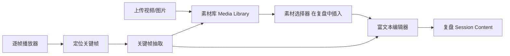
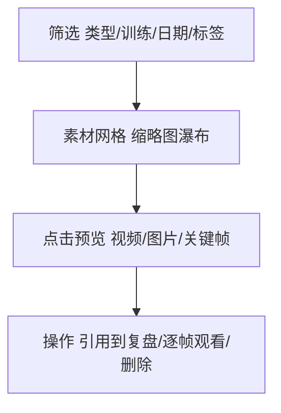

# CornerMan 拳角 · 素材库、关键帧与富文本编排方案

> 本文对应 [PRD v1.2](./prd.md) 与 [技术设计 v1.2](./tech-design.md)，遵循 [移动端优先设计规范](./mobile-design.md) 中确立的 **Apple HIG 视觉基准**（参照 `design-preview/ios-hig/`，含逐帧复盘播放器原型）。
>
> 解决的问题：复盘内容应是**富文本**，并且能把训练视频中的**关键帧快捷地嵌入文字**；同时用户的视频 / 图片 / 关键帧需要沉淀为可复用的**素材库**，在不同复盘中**选择、预览、引用**，而不是每次重新上传。

## 0. 关系总览



三件事环环相扣：**素材库**沉淀媒体；**逐帧播放器**产出关键帧；**富文本编辑器**消费素材与关键帧。

## 1. 素材库（Media Library）

### 1.1 定位

把当前「绑定在单个 Session 上的视频」升级为**用户级素材库**：用户所有训练里上传过的视频、图片，以及从视频里抽出的关键帧，统一汇聚、可检索、可预览、可在任意复盘中引用。

### 1.2 数据来源（复用现有能力）

- 现有 `Video`（上传 / 转码 / 封面 / `framesPrefix` 每秒抽帧）链路完整，直接作为素材库视频来源。
- 现有 `VideoSegment`（动作 / 拳型 / 证据片段）可作为「视频内的可引用片段」。
- 新增图片附件与关键帧（见 §2、§3），统一抽象为 `MediaAttachment`（[技术设计](./tech-design.md) 已规划）。

### 1.3 素材库页（/library）



- **网格预览**：HIG 风格缩略图网格，视频卡角标时长 + 播放标识，图片 / 关键帧直接显示缩略图。
- **筛选**：按媒体类型（视频 / 图片 / 关键帧）、所属训练、日期、标签筛选。
- **预览**：点击进入预览——视频进入逐帧播放器，图片 / 关键帧全屏查看；底部提供「引用到复盘」「删除」。
- **状态**：沿用 `uploading / processing / ready / failed`，未就绪素材显示进度而非阻塞。

### 1.4 素材选择器（复盘中「从素材库插入」）

在复盘编辑器里，除了「上传新视频」，新增「从素材库选择」：

- 唤起底部 Sheet 形式的素材选择器（HIG Sheet + 网格）。
- 多选 / 预览后插入到当前复盘，**引用而非复制**（同一素材可被多条复盘引用）。
- 适合「同一段实战视频既挂在实战复盘，也被力量体能复盘引用对比」的场景。

## 2. 关键帧抽取与「插入文本」

### 2.1 交互闭环（基于 HIG 逐帧播放器）

逐帧播放器原型已在 `design-preview/ios-hig/` 落地（帧步进 / 慢放 / 刷度轴 / 帧号时码）。在它的基础上把「收藏帧」升级为「插入复盘」：


- 在播放器找到关键瞬间（出拳定格、防守漏招）后，点「插入这一帧」。
- 该帧作为一个**关键帧节点**插入到富文本当前 block 的光标处，自动带上时码（如 `00:03.467`）与来源视频。
- 用户可在节点下补一句批注。点击关键帧节点可「回到视频该时刻」继续逐帧。

### 2.2 关键帧怎么抽

- 现有 worker 已做 `fps=1` 抽帧到 `framesPrefix`（粗粒度，每秒一帧）。
- 关键帧需要**精确到用户定格的时间戳**，方案：
  - 前端 `<canvas>` 即时截取当前 `<video>` 帧作为预览（零等待，先插入占位）；
  - 同时请求后端按精确 `timeMs` 用 ffmpeg `-ss` 抽一张高质量帧落 OSS，ready 后替换占位图。
- 抽出的关键帧作为 `MediaAttachment(kind = "keyframe")` 入素材库，可被再次引用。

### 2.3 富文本中的关键帧节点结构

富文本采用结构化 doc（TipTap / Lexical），关键帧是一个自定义 inline / block node：

```json
{
  "type": "keyframe",
  "attrs": {
    "mediaId": "media_abc",
    "sourceVideoId": "video_123",
    "timeMs": 3467,
    "frameNo": 104,
    "posterObjectKey": "keyframes/video_123/3467.jpg",
    "note": "出右直拳后左手护手掉到下巴以下"
  }
}
```

- `timeMs` / `frameNo` 让节点可「跳回视频该时刻」。
- 节点渲染为带时码徽标的小卡片，回看复盘时图文一体。

## 3. 富文本编辑器要求（承接 PRD）

- 引擎：`TipTap`（MVP 首选）/ `Lexical`，支持自定义 `keyframe` 节点。
- 基础排版：层级标题、有序 / 无序列表、加粗、高亮。
- 内联媒体：关键帧节点、图片节点；视频以「附件卡片」形式引用（点开进播放器）。
- 每个模板 block 是独立富文本实例，内容按 block id 存储（见 [技术设计](./tech-design.md) Session Content）。
- 移动端：工具栏精简，关键操作（插入关键帧 / 图片 / 列表）大触控；软键盘可下滑收起。

## 4. 逐帧复盘播放器规格（沉淀自 ios-hig 原型）

> 该原型已通过浏览器验证，作为 web 正式实现的交互与视觉基准。

| 能力 | 规格 |
| --- | --- |
| 帧步进 | `‹帧` / `帧›` 单帧前后；默认 30fps，步长 `1/fps`；长按连续步进 |
| 跳帧 | `±10 帧` 快速跳 |
| 慢放 | 分段控件 `0.25× / 0.5× / 1×`，改 `playbackRate` |
| 刷度轴 | 可拖动定位，播放头实时跟随（优先 `requestVideoFrameCallback`，回退 `timeupdate`） |
| 读数 | 实时显示「帧号」与「当前时码 / 总时长」，等宽数字 |
| 键盘 | `←/→` 单帧、`Shift+←/→` 跳 10 帧、空格播放暂停（桌面增强） |
| 插入 | 「插入这一帧」把当前帧送入富文本（见 §2） |
| 触控 | 控件满足 HIG 44pt 基线，主控播放键更大 |

实现注意：

- 单帧步进务必先 `pause()` 再设 `currentTime`，并在 `pointerdown` 即触发，避免 `preventDefault` 吞掉 `click`（原型踩过该坑）。
- 帧号 = `round(currentTime * fps)`；真实视频 fps 可从元数据 / 后端探测，未知时按 30 估算并标注。

## 5. 技术落地要点（详见技术设计）

| 关注点 | 方案 |
| --- | --- |
| 统一媒体模型 | `MediaAttachment(kind = video / image / keyframe, status, objectKey, posterObjectKey, sourceVideoId?, timeMs?)` |
| 素材库接口 | `GET /media`（用户级，支持 type / 训练 / 日期 / 标签筛选）、`GET /media/:id`、`DELETE /media/:id` |
| 关键帧抽取 | `POST /videos/:id/keyframe { timeMs }` → ffmpeg `-ss` 抽帧落 OSS，返回 `MediaAttachment` |
| 引用关系 | 复盘 content 内通过 `mediaId` 引用素材，引用非复制，删除素材需校验引用 |
| 复用 | 复用现有 presign 上传、转码、封面、`framesPrefix`；前端补 `framesPrefix` / 关键帧消费 |

## 6. 验收清单

- [ ] `/library` 可按类型 / 训练 / 日期筛选并预览视频 / 图片 / 关键帧
- [ ] 复盘编辑器可「上传新媒体」或「从素材库选择」插入（引用而非复制）
- [ ] 逐帧播放器具备帧步进 / 跳帧 / 慢放 / 刷度 / 读数，达 HIG 触控基线
- [ ] 「插入这一帧」可把关键帧插入富文本当前光标处，并带时码与来源
- [ ] 关键帧节点可点击跳回视频该时刻
- [ ] 关键帧抽取先用 canvas 占位、后端精确抽帧替换，不阻塞编辑
- [ ] 富文本支持标题 / 列表 / 加粗 / 高亮 + 关键帧 / 图片节点
- [ ] 删除被引用素材有保护或提示
