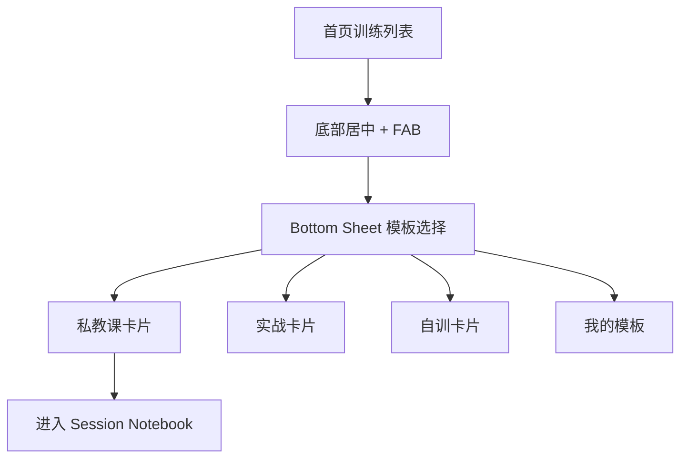
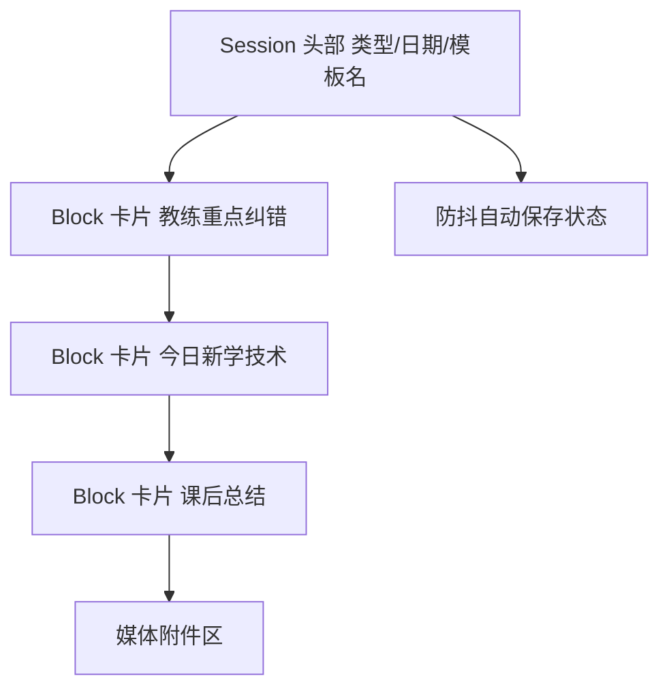
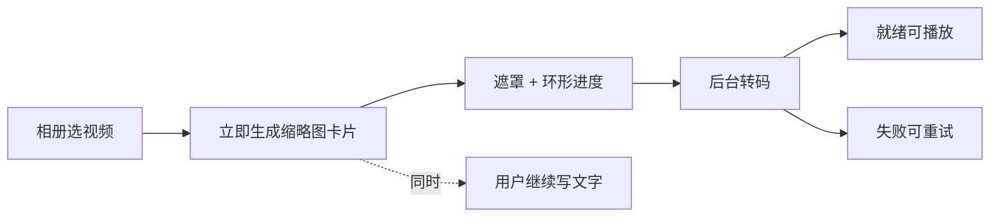

# CornerMan 拳角 · 移动端优先设计规范

> 本文是 MVP 的移动端交互与视觉规范，对应 [PRD v1.2](./prd.md) 与 [技术设计 v1.2](./tech-design.md)。本轮 MVP **移动端优先**：用户主要在实战或私教课后、双手出汗、轻微喘气的状态下使用，所有交互必须为这种「疲劳场景」服务。
>
> **视觉与交互基准（重要）**：本项目后续实现统一以 **Apple HIG 风格 Demo** 为准——`design-preview/ios-hig/`（系统字体 / 系统色 / 大标题导航 / Inset Grouped 列表 / 材质模糊 / Sheet / Tab Bar / 编辑模式 / 浅深色，并含**逐帧复盘播放器**原型：帧步进 / 慢放 / 刷度轴 / 帧号时码）。新功能（登录、趋势、素材库等）应沿用该 Demo 的组件与令牌。
>
> 可交互样式 Demo（直接用浏览器打开即可预览）：
> - ✅ **基准** · Apple HIG 风格：[`design-preview/ios-hig/index.html`](../design-preview/ios-hig/index.html)
> - 早期自有风格（保留参考，不再作为基准）：[`design-preview/mobile/index.html`](../design-preview/mobile/index.html)
>
> 专项交互见：[数据趋势方案](./trends-design.md)、[素材库 / 关键帧方案](./media-library-design.md)。

## 0. 核心设计原则：对抗疲劳带来的阻力

训练后的用户没有耐心、注意力下降、手指不精确。移动端的唯一核心原则是**降低录入阻力**，拆成四条可执行准则：

| 准则 | 含义 | 落地约束 |
| --- | --- | --- |
| 大触控区 | 手指出汗、不精确也能点中 | 主操作触控区 ≥ 44px，关键 CTA ≥ 48px，卡片整块可点 |
| 防误触 | 疲劳时容易误操作 | 破坏性操作需二次确认；删除用 SwipeAction 而非贴边小按钮 |
| 免等待 | 绝不让用户盯着 Loading | 视频后台上传，文字可同时编辑；保存走防抖自动保存 |
| 少层级 | 减少认知与跳转成本 | 新建记录用 Bottom Sheet 而非整页跳转；模板预加载好 Block |
| 暗色优先 | Gym 环境光线复杂 | 默认提供暗色主题，亮/暗双主题均需达标 |

> 一句话：让一个刚打完实战、累到不想动的人，也能在一两分钟内把这次训练记下来。

## 1. 入口与模板选择：底部半屏弹窗（Bottom Sheet）

不要为「新建记录」做一整个新页面，避免增加认知层级。

### 交互

- 首页底部居中放置显眼的 `+` 悬浮按钮（FAB）。
- 点击后从底部顺滑弹出半屏 Bottom Sheet，背景加 `backdrop-blur` 蒙层。
- 下滑手势或点击蒙层即可关闭，不强制用户找关闭按钮。

### 视觉

- 弹窗内不用纯文字列表，使用大圆角卡片（`rounded-2xl`）。
- 每张卡片含：图标 + 主标题（如「私教课」）+ 副标题（如「教练指导与纠错」）。
- 可加「最近使用」置顶，减少重复选择成本。
- 卡片整块可点，点击时轻微缩放（scale 0.97）给出反馈。

### 标杆参考

- Strava / Keep：点击记录时用底座弹窗快速选「跑步 / 骑行 / 健身」，触控区极大，盲按不出错。

## 2. 核心编辑页：多区块拼装（Block-based Editor）

用户选中模板后进入主编辑页，这里是「丝滑与友好」的关键。**不要给用户一个巨大的空白输入框。**

### 交互

- 页面预先加载好模板区块（如私教课的【教练重点纠错】【今日新学技术】【课后总结】）。
- 点击卡片内部直接唤起键盘，光标落到对应 Block。
- 滑动页面查看历史内容时，软键盘需支持**向下滑动手势收起**，不依赖微小的「完成」按钮。

### 视觉

- 采用 Notion / Craft 的 Block 概念：每个富文本区域是独立的白色圆角框（暗色模式为深灰底），带轻微阴影（`shadow-sm`）。
- 区块之间有明显留白，视觉上彼此独立。
- 空 Block 显示 placeholder 引导（如「记录教练指出的问题、改法和关键词」），降低「不知道写什么」的阻力。

### 标杆参考

- Day One：图文 / 视频混排的克制与优雅。
- Notion 移动端：用最少 UI 元素呈现复杂 Block 结构。

## 3. 视频挂载：异步且无感的后台进度

这是最容易搞砸体验的地方。几百兆的拳击视频上传需要时间，**绝不能用全屏 Loading 锁死操作**。

### 交互

- 用户点击「添加视频」，从相册选中后，视频**立刻**在富文本顶部或底部生成缩略图卡片。
- 用户可以马上继续在下方写文字，无需等待。

### 状态设计

- 缩略图卡片上覆盖半透明遮罩，中心显示平滑转动的**环形进度条**。
- 状态流转：`选择 -> 上传中(环形进度) -> 处理中(转码) -> 就绪(可播放) / 失败(可重试)`。
- 失败时卡片保留并提供「重试 / 删除」，不影响已写文字。

### 标杆参考

- Instagram / 微信朋友圈：选完视频后可一边打字，视频一边在后台压缩上传。

## 4. 自定义模板功能：拖拽与配置（Drag & Drop）

在「设置我的模板」界面，交互重点是直观的增删改。移动端优先用「点击添加 + 长按排序」，拖拽作为增强。

### 交互

- 字段库展示预设 Block（如：体能评分、回合数记录、自由文本）。
- 点击字段即添加到当前模板画板；长按列表项右侧的拖拽把手 `≡` 排序。
- 列表项提供大触控的拖拽把手，避免误触相邻项。
- 删除单个字段用 SwipeAction（左滑出现删除），并对必填项做保护。

### 标杆参考

- iOS 系统「快捷指令（Shortcuts）」。
- 表单工具 Typeform。

## 5. v1.2 新增交互（HIG 基准）

以下交互统一沿用 `design-preview/ios-hig/` 的组件与令牌。

### 5.1 逐帧复盘播放器

- 全屏黑底、顶部 `完成 / 标题 / 收藏帧`；中部视频；下部读数（帧号 + 时码）、刷度轴、transport（`±10帧 / ‹帧 / 播放 / 帧› / ±10帧`）、慢放分段（`0.25× / 0.5× / 1×`）。
- 帧步进 `pointerdown` 即触发，避免吞掉 click；播放头优先 `requestVideoFrameCallback`。
- 「插入这一帧」把关键帧送入富文本（见 [素材库方案](./media-library-design.md)）。

### 5.2 训练日期选择

- 复盘训练日期默认今天，点击「6 月 12 日 · 周五」唤起 HIG 日期选择 Sheet，提供「今天 / 昨天」快捷。
- 趋势范围用分段控件 `本周 / 本月 / 近 90 天 / 自定义`，自定义唤起日期范围 Sheet。

### 5.3 登录 / 注册

- 单页双 Tab，登录默认在前；大触控输入、即时校验、清晰错误文案、无全屏等待。
- 成功后进入训练列表；登录态过期自动续期，无感。

### 5.4 趋势看板

- 首屏一屏内：核心概览卡 → 实战 Form Guide（`●●○◐●`）→ 主趋势折线 → 关键指标卡（环比上 / 下，上绿下橙中性）。
- 折线数据点、Form Guide 圆点、波峰波谷均可点击跳回对应复盘。

### 5.5 素材库与选择器

- `/library` HIG 缩略图网格 + 类型 / 训练 / 日期 / 标签筛选；点击预览（视频进逐帧播放器）。
- 复盘内「从素材库选择」底部 Sheet + 网格，多选预览后引用（非复制）。

## 6. 前端落地建议（React + Tailwind）

为了实现「丝滑感」，技术选型走以下捷径：

### 动画反馈

- 引入 `framer-motion`：Bottom Sheet 的弹出、Block 拖拽排序、按钮按压（scale down to 0.95）、上传进度过渡，几行代码即可。
- 移动端「跟手感」基本靠动画过渡，不要用生硬的显隐切换。

### 原子化 CSS

- Tailwind utility classes 快速堆叠现代卡片风格：`rounded-2xl`、`shadow-sm`、`backdrop-blur`。
- 暗色模式用 `dark:` 前缀全局低成本适配；Gym 场景强烈建议默认暗色或提供暗色主题。

### UI 库借力

- 移动端可评估 `Ant Design Mobile` 或 `Zarm`：自带成熟的弹窗（Popup）、动作面板（ActionSheet）、滑动操作（SwipeAction），省去大量移动端手势冲突处理。
- 与现有桌面端 `Ant Design` 共存时，注意主题令牌对齐，避免双套视觉割裂。

## 7. 触控与尺寸基线

| 元素 | 最小尺寸 | 说明 |
| --- | --- | --- |
| 主 CTA 按钮 | 高 ≥ 48px | 保存、创建、添加视频 |
| FAB | 直径 ≥ 56px | 首页新建入口 |
| 普通可点元素 | ≥ 44px | 模板卡、Block、列表项 |
| 文字最小字号 | ≥ 14px 正文 | 疲劳场景下保证可读 |
| 卡片圆角 | `rounded-2xl`（16px） | 统一现代卡片风格 |
| 区块间距 | ≥ 12px | 防止误触相邻 Block |

## 8. 与桌面端的关系

- 本轮 MVP **移动端优先**：先打磨手机录入与回看路径，再向上适配平板与 PC。
- PC 复用同一套数据与路由，布局可扩展为多栏（编辑器 + 媒体并排），但不得反过来牺牲移动端体验。
- 桌面端深度整理（长文编辑、批量管理模板）可作为后续增强，不阻塞移动端闭环上线。

## 9. 设计验收清单

- [ ] 新建记录通过首页 FAB + Bottom Sheet 完成，无整页跳转
- [ ] 模板卡片触控区足够大，盲按不易误选
- [ ] 编辑页预加载 Block，无巨大空白输入框
- [ ] 软键盘可下滑收起
- [ ] 视频上传期间文字可继续编辑，无全屏 Loading
- [ ] 上传失败可重试，且不影响已写内容
- [ ] 自定义模板支持点击添加 + 长按排序
- [ ] 逐帧播放器具备帧步进 / 慢放 / 刷度 / 读数，达 HIG 触控基线
- [ ] 复盘可选择训练日期；趋势可选时间范围
- [ ] 登录 / 注册页符合 HIG 且登录态可自动续期
- [ ] 趋势看板首屏给出近况 + 主曲线 + 关键指标卡
- [ ] 素材库可筛选预览，复盘可从素材库引用
- [ ] 暗色主题在主要页面达标
- [ ] 主要 CTA 与可点元素满足触控尺寸基线
