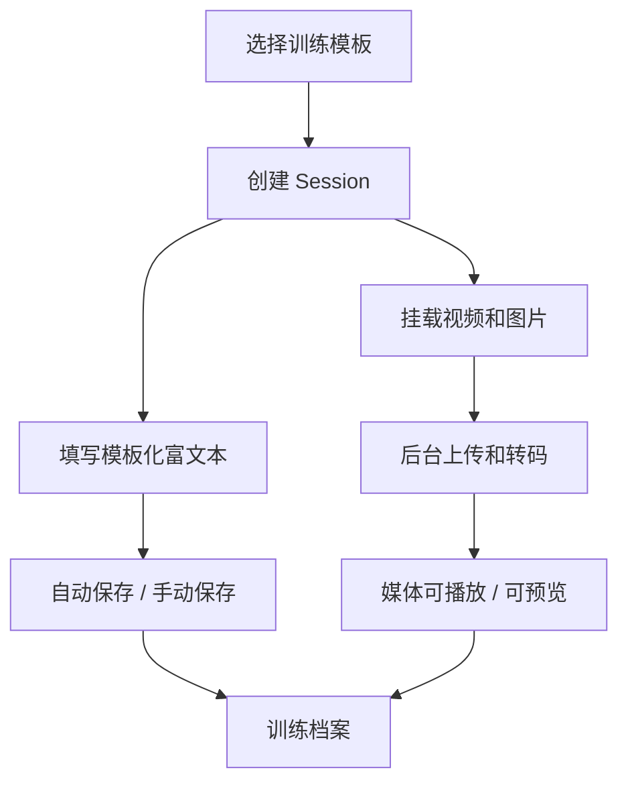

# CornerMan 拳角 · MVP 产品需求文档

> 当前版本 v1.2：在 v1.1「模板化训练记录」闭环（**选择场景化模板 -> 编写富文本复盘 -> 挂载视频/图片 -> 保存训练档案**）的基础上，本轮补齐**长期回看与复用**能力：账号登录注册、数据趋势看板（含实战成败展示）、训练日期选择、富文本中插入关键帧、以及跨训练的素材库。视觉与交互统一以 **Apple HIG** 为基准（参照 `design-preview/ios-hig/`，含逐帧复盘播放器原型）。
>
> 配套专项文档：
> - [数据趋势与战绩展示方案](./trends-design.md)：趋势看板、实战成败上下波动、日期 / 范围选择。
> - [素材库、关键帧与富文本编排方案](./media-library-design.md)：素材库选择预览、关键帧抽取与插入、逐帧播放器规格。
> - [移动端优先设计规范](./mobile-design.md)：HIG 视觉基准与疲劳场景交互。

## 0. 关键决策

| 项目 | 决策 |
| --- | --- |
| 产品定位 | 面向拳击爱好者的高效训练记录与复盘工具 |
| MVP 主交互 | 场景化模板 + 富文本内容 + 视频/图片附件 |
| 视觉基准 | 统一 Apple HIG 风格，以 `design-preview/ios-hig/` 为实现参照 |
| 账号 | 复用现成的 register / login / refresh / me 接口，补齐前端页面与登录态续期 |
| 长期价值 | 数据趋势看板 + 实战成败展示 + 跨训练素材库 |
| 复盘内容 | 富文本，可把视频关键帧快捷插入正文 |
| 暂时移出主线 | 语音 AI 识别、自动动作纠错、AI 评分、CV 智能打标签 |
| 保留能力 | 视频上传、后台转码、媒体展示、未来 AI/CV 扩展接口 |
| 目标设备 | 移动端优先录入，PC 适合深度整理与回看 |

## 1. 背景与问题

拳击训练者每周会经历私教课、自训、实战等不同场景。训练后的反馈往往散落在聊天记录、相册、备忘录和脑子里，几天后很难还原“这节课到底改了什么”“实战暴露了什么问题”“下次该重点练什么”。

旧方案把 MVP 主线押在 AI/CV 自动分析上，带来两个问题：

- 用户价值依赖模型质量，视频角度、遮挡、光线会让结果不稳定；
- 录入路径被“等待分析报告”牵着走，反而削弱了最确定的需求：快速记下训练复盘。

新 MVP 的核心判断是：**先让用户稳定记录，再让视频成为复盘证据，AI/CV 以后作为增强层接入。**

本轮还有一个明确的体验判断：**移动端优先**。用户主要在实战或私教课后、双手出汗、轻微喘气的疲劳状态下使用，所以移动端交互必须满足「大触控区、防误触、免等待、少层级」。完整的移动端交互与视觉规范见 [移动端优先设计规范](./mobile-design.md)。

## 2. 目标用户与场景

MVP 只服务一种用户：每周训练 2-4 次的拳击爱好者。

典型场景：

- **私教课后**：记录教练纠错、新学技术和课后总结，把教练示范或自己练习视频挂到同一次训练下。
- **实战日后**：记录对手风格、防守漏洞、有效打击和体能感受，视频用于回看关键回合。
- **自训后**：记录空击、沙袋、专项训练组数和身体状态，沉淀周期性训练轨迹。

## 3. MVP 产品目标

| 编号 | 目标 | 衡量方式 |
| --- | --- | --- |
| G1 | 降低记录门槛 | 用户无需面对空白页，能从模板开始写 |
| G2 | 3 分钟内完成一条训练复盘 | 选择模板、填写核心 block、保存成功 |
| G3 | 视频不阻塞文字记录 | 上传/转码在后台进行，文本可随时保存 |
| G4 | 支持长期回看 | Session 中同时保留结构化内容与媒体附件 |
| G5 | 为未来 AI/CV 留接口 | 视频、内容、模板结构足够稳定，可挂接分析结果 |

## 4. 非目标

| 编号 | 暂不做 | 原因 |
| --- | --- | --- |
| NG1 | 语音输入与语音转写 | 初期不稳定且偏离主流程，先做好文字录入 |
| NG2 | AI 自动生成复盘报告 | 当前版本不以模型质量作为 MVP 成败条件 |
| NG3 | 自动评分 / 自动动作纠错 | 视频条件复杂，过早承诺会损害可信度 |
| NG4 | 教练协作、多人账号、场馆版 | 单人训练者闭环优先 |
| NG5 | 模板市场或公开分享 | 先验证个人自定义模板价值 |
| NG6 | 社区、排行榜、与他人对比 | 趋势看板只看自己的状态曲线，不做竞技排名 |
| NG7 | 第三方 / 手机号登录 | MVP 先用现成的邮箱 / 用户名 + 密码，预留扩展 |

## 5. 核心业务实体

### Session（训练场次）

一次训练的核心容器，保存训练日期、类型、地点、时长、所选模板、富文本内容和媒体附件。

### Template（表单模板）

驱动 Session 创建的预设结构。模板由 JSON 描述，前端 Renderer 根据 blocks 动态生成编辑区。

### Rich-Text Content（富文本内容）

用户记录的核心图文数据。内容按 template block 存储，支持后续按字段检索和复用。

### Media Attachment（媒体附件 / 素材）

挂载在 Session 下的视频、图片或关键帧素材。视频上传、转码、封面生成在后台异步进行，不阻塞用户继续编辑复盘内容。素材统一汇聚到**素材库**，可被多条复盘**引用**（详见 [素材库方案](./media-library-design.md)）。

### Keyframe（关键帧）

从训练视频中按精确时间戳抽取的一帧，带时码与来源视频信息，可作为节点**插入富文本正文**，点击可跳回视频该时刻。

### Outcome（实战结果）

实战 / 约练类 Session 的结构化结果：`胜 / 负 / 平 / 不计`，可附对手、回合、暴露问题。用于训练列表与趋势看板的**战绩展示**，默认「不计」，不给日常约练强加胜负（详见 [趋势方案](./trends-design.md)）。

### Account（账号）

用户身份。后端已具备邮箱 / 用户名 + 密码的注册、登录、令牌刷新与当前用户接口；本轮补齐前端登录注册页面与登录态续期。

## 6. MVP 主流程



流程说明：

1. 用户点击“新建复盘”，先选择训练场景模板。
2. 系统基于模板生成富文本 block，用户直接在结构化区域里填写。
3. 用户可同步上传视频或图片，上传进度独立展示。
4. 文本内容可随时保存，不等待视频转码完成。
5. Session 保存后进入训练档案，可在列表和详情页回看。

## 7. 内置模板

### 私教课模板

适合固定私教日，例如周二、周五。

预设字段：

- 教练重点纠错
- 今日新学技术
- 课后总结

### 实战模板

适合约练、实战、对抗日，例如周三。

预设字段：

- 对手风格分析
- 暴露的防守漏洞
- 有效打击与高光时刻
- 体能消耗评估

### 自训模板

适合个人空击、沙袋、专项训练。

预设字段：

- 热身 / 空击组数
- 沙袋 / 专项训练内容
- 自我身体感受

## 8. 自定义模板

MVP 支持“我的模板”，但保持轻量：

- 从系统模板复制；
- 新增、删除、重排 block；
- 修改 block 标题、说明和是否必填；
- 保存为个人模板；
- 用个人模板创建新的 Session。

建议的 block 类型：

| 类型 | 用途 |
| --- | --- |
| `rich_text` | 主要复盘内容，支持标题、列表、加粗、高亮 |
| `short_text` | 单行信息，如对手姓名、场馆、训练目标 |
| `rating` | 主观评分，如体能消耗、执行满意度 |
| `checklist` | 动作清单、课后作业、训练计划 |
| `media_reference` | 预留媒体引用区，后续可扩展到视频片段引用 |

模板 JSON 示例：

```json
{
  "id": "private_lesson_default",
  "name": "私教课复盘",
  "scene": "private_lesson",
  "version": 1,
  "blocks": [
    {
      "id": "coach_correction",
      "type": "rich_text",
      "title": "教练重点纠错",
      "required": true
    },
    {
      "id": "new_technique",
      "type": "rich_text",
      "title": "今日新学技术"
    },
    {
      "id": "summary",
      "type": "rich_text",
      "title": "课后总结"
    }
  ]
}
```

## 9. 富文本与媒体要求

富文本编辑器 MVP 要求：

- 支持层级标题、列表、加粗、高亮；
- 支持每个 block 单独编辑和保存；
- 支持空内容提示，避免用户不知道该写什么；
- 支持移动端输入，不依赖复杂快捷键。

媒体附件 MVP 要求：

- 支持视频和图片上传；
- 视频后台异步上传、转码、生成封面；
- 上传不阻塞富文本编辑；
- 转码失败时保留错误状态并允许重试；
- Session 详情页能播放 ready 视频、预览图片。

移动端优先要求（详见 [移动端优先设计规范](./mobile-design.md)）：

- 新建记录通过首页 FAB + 底部半屏弹窗（Bottom Sheet）选择模板，不做整页跳转；
- 编辑页预加载模板 Block，避免巨大空白输入框；软键盘可下滑收起；
- 视频选中后立即生成缩略图卡片，上传期间用户可继续写文字，禁止全屏 Loading 锁死；
- 主要 CTA 与可点元素满足触控尺寸基线（主 CTA ≥ 48px，普通可点元素 ≥ 44px）；
- 默认提供暗色主题，适配 Gym 场景光线。

## 10. 账号与登录注册

后端已具备完整能力，本轮重点在前端与登录态：

- 复用接口：`注册 / 登录 / 刷新令牌 / 当前用户`（详见 [技术设计](./tech-design.md)）。
- 补齐 **HIG 风格登录 / 注册页面**：登录默认在前、注册可切换；大触控、清晰错误提示、无等待。
- 登录态续期：access 过期时用 refresh 自动续期；进入受保护页前校验当前用户，未登录跳登录。
- MVP 不做第三方 / 手机号登录，但结构上预留。

## 11. 数据趋势看板与实战成败

> 完整方案见 [数据趋势与战绩展示方案](./trends-design.md)。

- `/trends` 趋势看板：按「本周 / 本月 / 近 90 天 / 自定义」聚合训练次数、时长、综合分、关键指标与训练结构。
- 主趋势折线可切换指标，数据点可跳回对应复盘；关键指标卡显示**环比上 / 下**（上绿、下橙中性，不用告警红）。
- **实战成败展示**：实战可录入 `胜 / 负 / 平 / 不计`（默认不计）；用 Form Guide 近况条（`●●○◐●`）+ 胜率 / 状态折线呈现「上下波动」；负场卡片高亮暴露问题，改进后显示「已改进」，形成「失败 → 复盘 → 改进」闭环。
- 原则：只看自己的状态曲线与问题闭环，不做与他人对比的排行榜。

## 12. 训练日期选择

- 每条复盘可选择训练日期 `trainedAt`，默认今天，移动端用 HIG 风格日期选择 Sheet（含「今天 / 昨天」快捷）。
- 趋势看板时间范围用分段控件 + 自定义日期范围 Sheet。

## 13. 素材库与富文本关键帧

> 完整方案见 [素材库、关键帧与富文本编排方案](./media-library-design.md)。

- **素材库 `/library`**：用户所有视频 / 图片 / 关键帧统一汇聚，可按类型 / 训练 / 日期 / 标签筛选、预览。
- **选择预览与引用**：复盘编辑器除「上传新媒体」外，新增「从素材库选择」（底部 Sheet + 网格），引用而非复制。
- **关键帧插入富文本**：在逐帧播放器定位关键瞬间，点「插入这一帧」，关键帧带时码作为节点插入正文，可补批注、可点击跳回视频该时刻。
- **富文本升级**：每个模板 block 为富文本（标题 / 列表 / 加粗 / 高亮 + 关键帧 / 图片节点）。

## 14. AI/CV 扩展预留

当前 MVP 不展示 AI/CV 作为主能力，但架构保留扩展点：

- 视频存储与转码继续保留，为后续抽帧、片段识别做准备；
- Template block 可增加 `ai_hint`、`problem_code` 等元数据，供未来模型理解用户记录；
- Media Attachment 可在未来扩展 `analysisStatus`、`segments`、`autoTags`；
- Session 未来可挂 `AIReview`，但不影响当前富文本内容的创建和保存。

未来 v2.0 可能接入：

- 视频抽帧与动作片段识别；
- AI 自动生成复盘建议；
- 基于用户模板内容的智能摘要；
- 自动标签与片段引用。

## 15. 用户故事

| 编号 | 用户故事 | 优先级 |
| --- | --- | --- |
| US1 | 作为训练者，我想选择私教课 / 实战 / 自训模板，避免从空白页开始写 | Must |
| US2 | 作为训练者，我想按模板字段记录复盘内容 | Must |
| US3 | 作为训练者，我想上传训练视频，但不想等待上传完成才能写文字 | Must |
| US4 | 作为训练者，我想回看某次训练的文字记录和视频附件 | Must |
| US5 | 作为训练者，我想创建自己的力量体能模板 | Must |
| US6 | 作为训练者，我想在移动端完成训练后快速记录 | Must |
| US7 | 作为训练者，我想以后把视频片段挂到某条记录上 | Should |
| US8 | 作为训练者，我想按模板字段或关键词搜索历史记录 | Should |
| US9 | 作为训练者，我想注册 / 登录后在多设备看到自己的训练 | Must |
| US10 | 作为训练者，我想在趋势看板看到训练量与状态的变化曲线 | Must |
| US11 | 作为训练者，我想记录并回看实战胜负，看到自己最近的手感 | Should |
| US12 | 作为训练者，我想把视频里的关键一帧直接插到复盘文字里 | Must |
| US13 | 作为训练者，我想在素材库里挑已有视频 / 图片引用到复盘，不必重传 | Should |
| US14 | 作为训练者，我想为复盘选择训练日期 | Must |

## 16. 上线准入

MVP 上线前必须满足：

- 用户能注册 / 登录，并在登录态过期后自动续期；
- 用户能完整走通“选择模板 -> 填写富文本 -> 插入关键帧 / 上传视频图片 -> 保存 -> 回看”；
- 三套系统模板可用，至少支持一个自定义模板创建流程；
- 视频上传和文字保存互不阻塞；
- 素材库可筛选预览，并可在复盘中引用已有素材；
- 趋势看板可按时间范围聚合并展示主曲线与关键指标环比；实战可记录并展示成败；
- 移动端主要录入路径可用，视觉符合 HIG 基准与触控基线；
- UI 文案不再承诺 AI 自动判断、自动评分或自动纠错。
