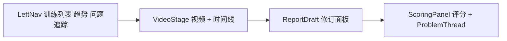
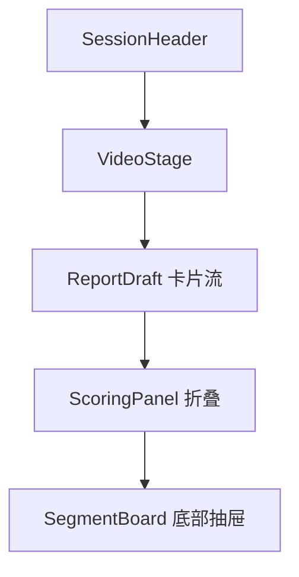

# CornerMan 视觉设计规范 · Coach Lab

> 已选定方案 **Coach Lab（教练实验室）** 作为产品默认视觉方向：浅灰 + 钢蓝 + 模块化。本文是该方案的设计规范与组件清单，作为前端实现（`apps/web` + `packages/ui`）的依据。
>
> 配套静态预览见 [`design-preview/coach-lab/`](../design-preview/coach-lab/index.html)，共享样式在 [`coach-lab.css`](../design-preview/coach-lab/coach-lab.css)。

## 1. 为什么是 Coach Lab

在 4 套候选（Ring Console / Fight Journal / Coach Lab / Minimal Athlete）中选定 Coach Lab，原因：

1. **最贴合产品叙事**：模块化结构能把"AI 起草 / 用户修订 / 置信度"三层关系讲清楚，正是 PRD 的核心。
2. **证据可追溯**：每条 AI 结论强制挂证据片段，符合"复盘要有证据"的目标。
3. **信息密度合适**：PC 三栏能塞下视频 + 报告 + 评分 + 问题，H5 退化为卡片纵列也成立。
4. **扩展成本低**：后续若加教练协作、训练对比，模块化网格几乎不用重构。

## 2. 设计原则

1. 拳击感服务于数据，不喧宾夺主。
2. 复盘效率优先：视频与 AI 卡片同屏对照，修订入口一眼可见。
3. 数据可信：AI 起草、用户修订、置信度三者在视觉上层次分明。
4. PC 主场（1440px 三栏为基准），H5 为等价降级而非残缺。

## 3. 设计令牌

对应 [`coach-lab.css`](../design-preview/coach-lab/coach-lab.css) 中的 CSS 变量，开发时可直接映射为 Tailwind preset 或 `packages/ui` tokens。

### 颜色

| 用途 | 变量 | 值 |
| --- | --- | --- |
| 主背景 | `--bg` | `#f4f6f8` |
| 卡片表面 | `--surface` | `#ffffff` |
| 次级表面 | `--surface-2` | `#eef1f5` |
| 描边 | `--line` | `#e2e6eb` |
| 强描边 | `--line-strong` | `#cdd4dd` |
| 主文本 | `--ink` | `#1f2937` |
| 次文本 | `--ink-2` | `#5b6470` |
| 辅助文本 | `--ink-3` | `#8a93a0` |
| 主色（钢蓝） | `--blue` | `#1e5aa8` |
| 用户修订（橙） | `--orange` | `#f08a24` |
| 已改进（绿） | `--green` | `#1fa971` |
| 仍存在 / 风险（红） | `--red` | `#d14747` |
| 低置信度（琥珀） | `--amber` | `#c8892f` |

颜色语义约定（重要）：

- **钢蓝** = 系统主操作、导航、AI 采纳、出拳片段。
- **橙** = 一切"用户修订/我的补充"，与 AI 蓝形成对照。
- **绿 / 红 / 橙** = 问题三态：已改进 / 仍存在 / 新增。

### 圆角与字体

- 圆角：`--radius-lg 14px` / `--radius 10px` / `--radius-sm 7px`
- 字体：`Inter` + `PingFang SC` / `HarmonyOS Sans`，无衬线统一
- 触控尺寸：PC 最小点击区 32px，H5 提升到 44px

## 4. 报告页信息架构

报告页由 6 个模块组成（其余页面复用同一组件语言）：

| 模块 | 内容 | PC 位置 | H5 位置 |
| --- | --- | --- | --- |
| SessionHeader | 训练日期、类型、时长、地点、状态、保存态 | 主区顶部模块 | 顶部 |
| VideoStage | 视频播放器 + 片段时间线 | 主区 | 顶部下方 |
| ReportDraft | AI 起草卡片，采纳/修改/删除/新增 | 右栏 | 视频下方卡片流 |
| ScoringPanel | 5 维评分雷达 + 条形 + 置信度 | 右栏 | 折叠卡片 |
| SegmentBoard | 关键片段、标签、备注 | 主区/右栏 | 底部抽屉 |
| ProblemThread | 同类问题跨训练状态 | 右栏底部 | 顶部 chip 跳转 |

### PC 三栏骨架



### H5 单列骨架



### 多视频素材库与报告覆盖状态

报告是「一次训练」的复盘，一个 Session 可挂多个视频（多机位 / 多回合 / 补传）。多视频时信息架构补充以下规则（借鉴 Onform / CoachNow 的「素材库」心智与 SwingVision 的「AI 报告可重新生成」心智）：

| 元素 | 位置 | 规则 |
| --- | --- | --- |
| 视频序号 | VideoStage 标题 + 证据 chip | 按上传时间升序编号「视频 1 / 视频 2…」，两处编号一致；单视频时不展示 |
| 纳入状态徽章 | 每个视频卡片状态行 | ready 且已有报告时显示「已纳入复盘」（绿）/「未纳入复盘」（橙）；处理中沿用原状态徽章 |
| 覆盖提示条 | ReportDraft 顶部 | 存在未纳入视频时显示「有 N 个新视频尚未纳入当前复盘」，附「重新生成完整复盘」主按钮与一行说明 |
| 重新生成 | 报告顶部提示 + 视频模块右上角 | 破坏性确认：会作废当前 AI 草稿与我的修订、用全部视频重建，原始视频保留；仅查看时无需重新生成 |
| 证据 chip 文案 | ReportDraft 条目 | 多视频时为「视频 N · 12.4–16.8s」，点击跳到对应视频与时间点 |

覆盖状态由 API `SessionReportDTO.coverage` 提供（`readyVideoCount / includedVideoCount / unincludedVideoIds / reportUpdatedAt`），前端不重复推算。

## 5. 组件清单

下列组件已在静态预览中实现，开发时对应 `packages/ui`：

| 组件 | CSS 类 | 说明 |
| --- | --- | --- |
| 顶栏 | `.topbar` `.brand` | 全局头部，含品牌、保存态、主操作 |
| 左导航 | `.sidebar` `.nav-item` `.kpi` | 训练 / 成长分组 + 本周 KPI |
| 按钮 | `.btn` `.btn-primary` `.btn-ghost` | 主/次/幽灵三态 |
| 模块卡 | `.module` `.module-head` `.module-body` | 通用带标题容器 |
| 统计条 | `.stat-strip` `.stat-box` | 4 格指标 |
| 标签/徽章 | `.tag` `.badge` | 类型标签、问题三态徽章 |
| 表单 | `.field` `.input` `.textarea` `.seg-control` | 含分段控件 |
| 表格 | `.table` | 训练列表 |
| 视频台 | `.video-frame` `.hud` `.timeline` `.track` `.seg` | 播放器 + 片段时间线 |
| AI 起草卡 | `.draft-card` `.draft-metabar` `.source-chip` `.evidence` `.card-actions` | 核心：起草/修订双态 + 证据 + 操作行 |
| 评分 | `.score-card` `.radar-wrap` `.bar` `.ai-fill` `.user-fill` `.conf-ring` | 雷达 + 条形对照（AI 虚线 / 用户实线）|
| 问题追踪 | `.problem` `.thread` `.node` | 跨训练时间轴串联 |
| 趋势图 | `.barchart` + 内联 SVG 折线 | 训练量柱状、评分折线 |

### AI 起草卡片结构（核心交互）

```
.draft-card
├── .draft-metabar     标题（优点/问题/已修订）+ 来源 chip（AI 起草 / 我的修订）
├── .draft-text        正文；修订后用 .struck 保留 AI 原文删除线
├── .evidence-row      证据片段 chip（点击跳时间线）
└── .card-actions      采纳 / 修改 / 删除（已采纳后变"已采纳·再改"）
```

- AI 原始版（`draft`）只读快照，用户修订写入 `final`，视觉上用橙色 `source-chip.mine` 区分。
- 评分条形：虚线灰 `.ai-fill` = AI 原始分，实色蓝 `.user-fill` = 用户修订分；雷达图同理双层叠加。

## 6. 静态页面清单

全部位于 [`design-preview/coach-lab/`](../design-preview/coach-lab/index.html)，对应 MVP 路由：

| 文件 | 路由 | 说明 |
| --- | --- | --- |
| `index.html` | — | 预览导航入口 |
| `login.html` | `/login` | 登录/注册（注册即登录，无短信） |
| `sessions.html` | `/sessions` | 训练列表 + 累计统计 |
| `session-new.html` | `/sessions/new` | 新建训练 + 视频上传 |
| `report.html` | `/sessions/[id]` | 训练报告（核心页） |
| `trends.html` | `/trends` | 趋势看板 |
| `problems.html` | `/problems` | 问题追踪 |

## 7. 响应式策略

| 断点 | 宽度 | 布局 |
| --- | --- | --- |
| PC | `≥ 1080px` | 报告页三栏；其他页左导航 + 内容两栏 |
| 平板/小屏 | `< 1080px` | 隐藏左导航，单列；右栏移到内容下方 |
| 手机 H5 | `< 560px` | 统计条变两列、卡片角标转行内、按钮压缩 |

## 8. 交付给开发的下一步

1. 用 `coach-lab.css` 的令牌建立 `packages/config` 的 Tailwind preset。
2. 在 `packages/ui` 按第 5 节组件清单逐个落地（优先 `DraftCard`、`ScoringPanel`、`VideoStage`）。
3. 在 `apps/web` 按第 6 节路由接入，先用 mock 数据，再对接 `api`。
4. 报告页优先实现，因为它承载了产品最核心的"AI 起草 + 用户定稿"闭环。
