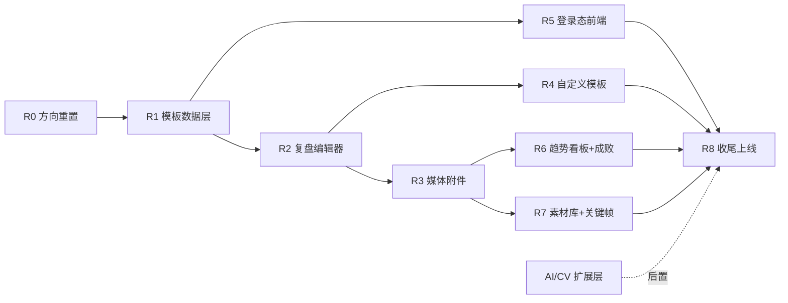

# CornerMan 执行路线图

> 本路线图对应 [PRD v1.2](./prd.md)、[技术设计 v1.2](./tech-design.md) 与 [移动端优先设计规范](./mobile-design.md)，并配套 [数据趋势方案](./trends-design.md)、[素材库 / 关键帧方案](./media-library-design.md)。项目主线为“模板化训练记录 + 富文本 + 媒体附件”，并确立**移动端优先**与 **Apple HIG 视觉基准**（`design-preview/ios-hig/`）。已有账号、视频上传、转码、抽帧能力尽量复用；AI/CV 能力暂时后置。

## 设计原则

- **记录闭环优先**：用户能稳定创建、填写、保存、回看训练复盘，优先级高于任何智能分析。
- **模板驱动录入**：所有 Session 从模板创建，避免空白页输入。
- **媒体异步与复用**：视频/图片上传和处理不能阻塞文字记录；素材沉淀到素材库可跨复盘引用。
- **长期价值**：趋势看板呈现状态曲线与实战成败，把每次下滑 / 失败转化为可复盘的一次。
- **低破坏迁移**：不急于删除旧 AI/CV 代码，先从产品主入口降级和隐藏；复用现成 auth 接口。
- **HIG 基准**：所有界面以 `design-preview/ios-hig/` 为视觉与交互参照。
- **移动端优先**：训练后疲劳场景下手机录入是第一战场，遵循「大触控区、防误触、免等待、少层级」（详见 [移动端优先设计规范](./mobile-design.md)）；PC 后续适配，不得反向牺牲移动端体验。

## 状态图例

- `[x]` 完成
- `[~]` 进行中
- `[ ]` 未开始

当前新路线状态：**R0 已确认，R1 后端已落地（curl 烟测 11/11 通过），R2 复盘编辑器前端已落地（浏览器主链路验证通过），R3 待开始**。

```text
R0 方向重置 ✅ -> R1 模板数据层 ✅ -> R2 复盘编辑器 ✅ -> R3 媒体附件
   -> R4 自定义模板 -> R5 登录态前端 -> R6 趋势看板与实战成败
   -> R7 素材库与关键帧 -> R8 收尾上线
```

> 设计阶段产出：HIG 风格 Demo（`design-preview/ios-hig/`，含逐帧复盘播放器原型）已完成并验证，作为后续实现的视觉与交互基准。

---

## R0 · 产品方向重置（已完成）

目标：把项目文档从 AI/CV 主线重置为模板化训练记录主线。

- [x] 明确 MVP 新定位：拳击训练记录与复盘工具
- [x] 明确主流程：选择模板 -> 填富文本 -> 挂载视频/图片 -> 保存
- [x] 明确 AI/CV 降级为未来扩展层
- [x] 重写 PRD 与技术设计

**退出标准**：团队后续讨论和开发均以 v1.1 文档为准，不再把“自动 AI 报告”视为 MVP 必达项。

---

## R1 · 模板数据层

目标：让系统具备模板定义、模板读取和基于模板创建 Session 的能力。

- [x] Prisma 新增 `Template` 模型
- [x] `TrainingSession` 增加 `templateId`、`templateSnapshot`、`content`、`outcome`、`savedAt`
- [x] 在 seed 中写入三套系统模板：私教课、实战、自训（`prisma/seed.ts` + `tsx`）
- [x] `packages/shared-types` 新增 Template schema、Block 类型、Session content、Outcome 类型
- [x] `api/templates`：列表、详情、创建、更新、软删、复制接口 + schema 运行时校验
- [x] `api/training-sessions`：创建 Session 时支持 `templateId` 写入快照与空内容骨架；新增 `PATCH :id/content`、`PATCH :id/meta`（含 outcome）

**退出标准**：调用 API 能拿到三套系统模板，并能用任一模板创建带 `templateSnapshot` 的 Session。✅ 已达成（`apps/api/scripts/smoke-templates.sh` 烟测 11/11 通过）。

---

## R2 · 模板化复盘编辑器

目标：把 Session 详情页从 AI 报告页改为模板化编辑页。

- [x] 首页底部 `+` FAB + Bottom Sheet 模板选择（替代整页跳转）
- [x] 新建主按钮改为“新建复盘”（FAB），系统/个人模板分组展示
- [x] 训练日期选择（默认今天，含「今天 / 昨天 / 选择日期」快捷；编辑页内日期可改）
- [x] `/sessions/[id]` 模板 Session 默认展示 `SessionEditor`（全 HIG 页）
- [x] 根据 `templateSnapshot.blocks` 动态渲染独立 Block 卡片
- [x] 实现最小富文本编辑能力：标题、列表、加粗、高亮（TipTap，为关键帧节点预留扩展点）
- [x] 引入 `framer-motion`：Bottom Sheet 弹出 + 下滑/蒙层关闭、卡片按压反馈
- [x] Block 空态 placeholder 引导；rating/checklist/short_text 块
- [x] `PATCH /training-sessions/:id/content` 保存 block 内容（800ms 防抖自动保存）
- [x] 保存状态展示：保存中 / 已保存 / 保存失败（导航右侧胶囊）
- [x] 实战成败编辑（胜/平/负/未记 + 对手 + 回合）写入 `PATCH :id/meta`
- [x] 模板 Session 隐藏原 AI 报告、评分、姿态指标入口（旧 AI Session 维持原页面）

**退出标准**：移动端用户能通过 FAB + Bottom Sheet 选模板创建 Session，在预加载的 Block 中填写并自动保存，刷新页面后内容不丢失。✅ 已达成（浏览器走通 登录→FAB→选实战模板→编辑器→输入富文本+选「胜」→API 校验 content/outcome/savedAt 落库，刷新后内容回显）。

> 说明：素材库选择 / 关键帧插入（`media_reference` 块当前为占位）留待 R7；自定义模板 Builder 留待 R4。

---

## R3 · 媒体附件异步化

目标：把视频能力从“触发 AI 报告”改为“Session 素材附件”。

> 落地范围（最小改造）：复用现有 `Video` 表与上传管线，把视频以「异步附件卡片」嵌入 HIG 复盘编辑器；图片附件与 worker 解耦（新表 / 拆队列）留待后续。AI 报告对模板复盘不再展示，已在 R2 编辑器中去除阶段条。

- [x] 确认采用 `MediaAttachment` 新表或临时复用 `Video` 表 —— 复用 `Video` 表
- [ ] ~~若新增 `MediaAttachment`，实现视频/图片统一上传模型~~（图片留待后续）
- [x] 选择文件后立即生成占位卡片（不等上传完成）
- [x] 卡片遮罩 + 环形进度，状态 `uploading -> uploaded/processing -> ready/failed`
- [x] 上传期间复盘内容可继续编辑，禁止全屏 Loading
- [x] 视频 ready 后展示封面，点击就地播放（playbackUrl）
- [x] 上传失败支持重试，已上传视频支持删除（`DELETE /videos/:id` 软删）
- [x] 移除“等待 AI 分析中 / 待复盘 / 已复盘”等旧阶段条文案（HIG 编辑器无阶段条）

**退出标准（达成）**：移动端用户可以一边填写复盘、一边上传视频，看到卡片上的环形进度；上传失败可重试、已上传可删除，且不影响内容保存。图片附件与 worker 解耦后续迭代。

---

## R4 · 自定义模板 Builder

目标：允许用户保存自己的训练模板，例如“力量体能训练”。

- [ ] 新增 `/templates` 页面
- [ ] 展示系统模板和个人模板
- [ ] 支持从系统模板复制为个人模板
- [ ] 字段库「点击添加 + 长按拖拽把手排序」（移动端优先），删除用 SwipeAction
- [ ] 支持修改 block 标题、说明、类型、是否必填，必填项删除保护
- [ ] 保存后可在新建入口 Bottom Sheet 中选择个人模板
- [ ] 对 Template schema 做运行时校验，避免非法 block 进入编辑器

**退出标准**：用户能在移动端创建一个个人模板（如「力量体能训练」），并用该模板创建新的训练复盘。

---

## R5 · 登录态前端补全

目标：把现成的后端 auth 接口接成完整的前端登录闭环（后端不新增）。

- [ ] 登录 / 注册页改为 HIG 风格（登录默认在前，即时校验，清晰错误文案）
- [ ] `api-client` 增加 401 拦截 + `refreshToken` 自动续期并重放原请求
- [ ] refresh 失效时清理登录态并跳转登录
- [ ] 受保护页登录守卫（必要时调 `me` 校验），引入 Auth Context
- [ ] `/sessions` 等页面读取上下文当前用户，去掉重复 `localStorage` 读取

**退出标准**：用户可注册 / 登录；access 过期能无感续期；未登录访问受保护页跳登录。

---

## R6 · 趋势看板与实战成败

目标：让训练数据沉淀为可回看的状态曲线，并支持实战成败展示（详见 [趋势方案](./trends-design.md)）。

- [ ] `TrainingSession` 增加 `outcome` 字段；实战模板加入 `胜 / 负 / 平 / 不计` 录入（默认不计）
- [ ] 后端 `GET /metrics/trends`、`GET /metrics/outcomes` 聚合接口（可用 `WeeklyMetric` 预聚合）
- [ ] `/trends` 页落地：时间范围分段控件 + 自定义日期范围 Sheet
- [ ] 核心概览卡 / 主趋势折线（可切指标）/ 关键指标卡（环比上下）/ 训练结构 / 波峰波谷
- [ ] 实战 Form Guide 近况条 + 胜率 / 状态折线；负场卡片展示暴露问题与「已改进」
- [ ] 数据点 / 圆点可跳回对应复盘；缺 AI / 视频数据时降级而非报错
- [ ] 导航 `/trends` 由「即将开放」改为可用

**退出标准**：用户能按时间范围查看训练量与状态曲线，记录并回看实战成败，且各处「上 / 下」语义一致（上绿 / 下橙中性）。

---

## R7 · 素材库与富文本关键帧

目标：媒体沉淀为可复用素材库，并把视频关键帧插入富文本（详见 [素材库 / 关键帧方案](./media-library-design.md)）。

- [ ] `MediaAttachment` 增加 `userId / kind(keyframe) / sourceVideoId / timeMs / tags`
- [ ] `GET /media` 用户级素材库（类型 / 训练 / 日期 / 标签筛选）+ `GET /media/:id`
- [ ] `/library` 页：HIG 缩略图网格 + 筛选 + 预览（视频进逐帧播放器）；导航 `/segments` 升级为素材库
- [ ] 复盘编辑器「从素材库选择」底部 Sheet 选择器（引用而非复制）
- [ ] web 落地逐帧复盘播放器（对齐 `design-preview/ios-hig/` 原型）
- [ ] `POST /videos/:id/keyframe` 精确抽帧；前端 canvas 占位 + ready 替换
- [ ] 富文本 `keyframe` 节点：带时码、可补批注、点击跳回视频该时刻
- [ ] 删除被引用素材有保护 / 提示

**退出标准**：用户能在素材库筛选预览、在复盘中引用已有素材，并把逐帧定位的关键帧插入复盘正文、点击跳回视频。

---

## R8 · 收尾上线

目标：验证 MVP 新闭环可用，清理旧文案和入口。

- [ ] 训练列表按模板、训练类型、日期筛选
- [ ] 移动端录入体验检查：触控尺寸基线、软键盘收起、暗色主题、HIG 一致性
- [ ] 关键路径 Playwright（含 `iphone-13`）覆盖：注册登录 -> FAB 选模板 -> 选日期 -> 编辑 -> 插入关键帧 / 引用素材 -> 保存 -> 回看 -> 趋势看板
- [ ] README 和产品文案同步新定位
- [ ] 旧 AI/CV 入口全部隐藏或标注“实验能力”
- [ ] 核心埋点：注册登录、创建复盘、保存内容、上传 / 引用素材、插入关键帧、自定义模板创建、查看趋势

**退出标准**：无需 AI/CV 服务，用户也能完整走通“登录 -> 选择模板 -> 选日期 -> 富文本 + 关键帧 -> 引用 / 上传媒体 -> 保存 -> 回看 -> 趋势”。

---

## 新阶段依赖关系



## 与旧路线的关系

旧 P0-P4 已完成的资产不直接废弃：

- 账号、Session、列表、新建训练页面继续复用；
- 视频上传、对象存储、后台转码继续复用；
- `video-worker` 继续承担媒体处理；
- `ai-service`、`AnalysisReport`、`Score`、`VideoSegment` 暂时从主入口隐藏，后续作为 AI/CV 插件回归。

需要改变的是产品主承诺：MVP 不再要求用户等待 AI 报告，不再把自动评分作为完成复盘的前提。

## 风险登记

| 风险 | 影响 | 对策 |
| --- | --- | --- |
| 旧 AI 代码和新模板主线混杂 | 用户理解混乱，开发边界不清 | 先隐藏旧入口，文案统一改为记录工具 |
| 富文本编辑器集成过重 | 拖慢 MVP | 只做最小工具栏，不做复杂块编辑器 |
| 自定义模板 Builder 过度设计 | 偏离核心录入体验 | 先支持复制和增删 block，不做模板市场 |
| 媒体模型迁移复杂 | 影响上传稳定性 | 可先复用 `Video` 表，后续再统一为 `MediaAttachment` |
| 移动端富文本体验差 | 训练后不愿记录 | 优先优化单列输入和保存反馈 |
| 趋势聚合实时计算压力 | 看板慢 | 用 `WeeklyMetric` 预聚合，按周期落库 |
| 胜负展示带来挫败感 | 用户抗拒记录实战 | 默认「不计」；下滑用中性 / 橙色；负场强调问题闭环而非计分 |
| 关键帧抽取等待 | 阻塞编辑 | 前端 canvas 占位即时插入，后端精确抽帧 ready 后替换 |

## 上线准入清单

- [ ] 用户可注册 / 登录，登录态可自动续期
- [ ] 三套系统模板可用，至少一个个人模板创建流程可用
- [ ] 复盘可选训练日期；Session 内容（含关键帧节点）刷新不丢失
- [ ] 视频 / 图片上传不阻塞内容保存
- [ ] 素材库可筛选预览，复盘可引用已有素材
- [ ] 逐帧播放器可帧步进 / 慢放，并可「插入这一帧」到富文本
- [ ] 趋势看板可按时间范围聚合主曲线与关键指标环比；实战成败可记录并展示
- [ ] 移动端能完成主要记录路径，满足 HIG 基准、触控尺寸基线与暗色主题
- [ ] 旧 AI/CV 文案不再出现在 MVP 主流程
- [ ] AI/CV 服务关闭时核心路径仍可用
