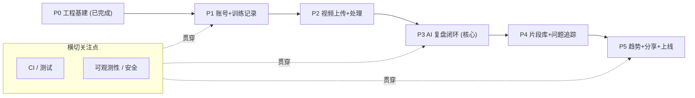

# CornerMan 执行路线图

> 本文档是项目**唯一的执行进度跟踪文档**：负责"做到哪了 / 下一步做什么"。
> "做什么 / 为什么"看 [产品需求文档](prd.md)，"怎么做"看 [技术设计](tech-design.md)。
> 每完成一个阶段或任务，更新这里的勾选状态，并按规则在 [worklog.md](worklog.md) 记一条。

## 设计原则
- **纵切交付**：每个阶段打通一条从 UI → API → DB 的完整链路，而非按模块横向铺开；每阶段结束都要有可演示成果。
- **退出标准驱动**：每阶段定义可验证的退出标准（Exit Criteria），达成才进入下一阶段。
- **单人节奏**：用阶段 / 检查点推进，而非固定周数排期；同时保留与 PRD 6 周里程碑的映射，便于估算。
- **遵守日志规则**：每次大型改动追加 [worklog.md](worklog.md)（见 `.cursor/rules/worklog.mdc`）。
- **置信度优先**：AI 结论一律带置信度、可一键修订；任何被包装成"绝对判断"的设计都要砍掉（呼应 PRD 第 13 节准入）。

## 状态图例
- `[x]` 完成 · `[~]` 进行中 · `[ ]` 未开始

整体进度：**P0 完成，P1 完成，P2 完成，P3 完成，P4 进行中（ai-service 真实姿态分析已提前落地）**。

```
P0 基建 ✅ → P1 账号+训练记录 ✅ → P2 视频上传+处理 ✅ → P3 AI 复盘闭环 ✅ → P4 片段+追踪 → P5 趋势+上线
```

---

## P0 · 工程基建（已完成）
对应 PRD/tech-design 第 1-2 周「骨架」的工程底座部分。

- [x] monorepo 骨架（pnpm workspaces + Turborepo，4 apps / 5 packages）
- [x] 本地 infra：Podman + podman-compose 拉起 Postgres / Redis / MinIO
- [x] 四服务可启动验证：`web` / `api` / `ai-service` / `video-worker`
- [x] 工作日志机制（`docs/worklog.md` + `.cursor/rules/worklog.mdc`）

**退出标准（已达成）**：`pnpm infra:up` 起依赖，四个服务均可启动，health/queue 连通。

---

## P1 · 账号 + 训练记录纵切（已完成）
第一条端到端纵切，验证 web ↔ api ↔ db ↔ ui 协作。对应 PRD US1/US2。

- [x] `prisma migrate`：落地 `User`、`TrainingSession` 表（migration `init`，PrismaService/Module 全局注入）
- [x] `api/auth`：邮箱/用户名 + 密码注册登录、bcrypt 哈希、JWT（access 15min + refresh 30d）、自定义 `JwtAuthGuard`、`GET /auth/me`
- [x] `api/training-sessions`：创建 / 列表 / 详情（受 JWT 守卫，userId 取自 token）
- [x] `packages/api-client`：fetch 封装（自动 Bearer + 结构化错误），auth 与 training-sessions 调用
- [x] `packages/ui`：从 `design-preview/coach-lab` 迁移基础组件（Button/Input/Textarea/Field/Card/Tabs/AppShell）
- [x] `web`：登录/注册页、训练列表页、新建训练页、详情页接通真实接口，客户端路由守卫 `AppFrame`
- [x] 响应式：PC 侧边导航 + 内容栅格，H5 窄屏自适应

**退出标准（已达成）**：注册 → 登录 → 创建并查看训练记录端到端跑通（curl + 浏览器冒烟均通过），PC 与移动端 H5 布局可用，`tsc --noEmit` 全绿。

> 备注：本机 5432 端口被既有 `postgresql@14` 占用，容器 Postgres 宿主机端口改为 **5433**（见 `infra/docker-compose.yml` 与 `.env`）。

---

## P2 · 视频上传 + 处理（已完成）
对应 PRD「视频上传 / 视频处理」Must 项。

- [x] `api/videos`：MinIO 预签名 PUT 直传凭证、上传完成回调、`Video` 状态机（uploading→uploaded→processing→ready/failed），`StorageService` 抽象预留阿里云 OSS
- [x] `web`：上传组件（PC 拖拽 + H5 `capture` 相册/拍摄），XHR 进度条 + 失败提示
- [x] `video-worker`：消费 `video.process`，`ffmpeg` 转码 720p/360p + 首帧封面 + 每 1s 抽帧
- [x] `video-worker`：基于场景切点粗切片，产出候选 `VideoSegment`，写回 ready 并入队 `ai.analyze`

**退出标准（已达成）**：视频可经预签名直传，后台自动转码并产出封面与候选片段；curl 全链路（init→PUT→complete→ready）通过，MinIO CORS 对 `localhost:3000` 预检/PUT 正常，封面签名 URL 可读，`ai.analyze` 已入队待 P3 消费。

> 前置：本机需安装 `ffmpeg`/`ffprobe`；MinIO 通过容器环境变量 `MINIO_API_CORS_ALLOW_ORIGIN` 放行浏览器直传（见 `infra/docker-compose.yml`）。

---

## P3 · AI 复盘闭环（核心价值）✅
对应 PRD 第 3-4 周「AI 闭环」与第 8 节"起草 + 定稿"模型。`ai-service` 维持 stub，优先打通链路。LLM 采用 `LLMProvider` 抽象，默认 **DeepSeek**（OpenAI 兼容、JSON Output、纯文本），无 key 或调用失败时自动降级确定性 stub，链路始终能出 draft。

- [x] `ai-prompts`：报告起草 prompt 模板（结构化输入 → summary/items/scores 严格 JSON）+ `renderReportDraftPrompt` + 版本号，改为 build 到 dist
- [x] 打通 `video-worker（第二个 ai.analyze Worker）→ DeepSeek/stub → AnalysisReport(draft) + Score(ai)`，附证据片段引用，按 session 幂等
- [x] `api/reports`：`draft` 只读快照 + `final` 可编辑两层组装与读写（GET 聚合 + finalize 懒克隆）
- [x] `api/scoring`：7 维评分（AI 原始分 + 置信度 + 用户修订分并存），返回 `score/confidence/rationale/evidence`
- [x] `api/revisions`：逐条「采纳 / 修改 / 删除 / 新增」，保留 AI 原文（aiOriginal 快照）
- [x] `web`：报告页（draft/final 切换、逐条修订、滑块改分、证据片段时间 chip、draft 轮询）

**退出标准（已达成）**：上传后自动异步出 draft 报告（summary + items + 7 维评分）；用户可逐条定稿且 AI 原文保留；改分与修订均落库。curl 全链路（注册→建 session→上传→ready→draft→finalize→edit/add/delete→改分）通过，draft 始终不可变；web 报告页渲染并可交互；`tsc --noEmit` 全绿。DeepSeek 真实生成已接通（当前所提供 key 经直连验证为 401 失效，已自动降级 stub，更换有效 key 即生效）。

---

## P4 · 片段库 + 问题追踪
对应 PRD US5/US8 与「片段库 / 问题追踪」。

- [x] `ai-service` 真实姿态分析（提前启动）：MediaPipe Pose（CPU）+ OpenCV ~8fps 采样，产出动作片段（punch_burst / high_activity / low_activity）与量化指标（出拳次数、护手到位率、站距、活动占比）；`video-worker` 切片改为动作驱动（ai-service 失败/降级自动回退机械切片），姿态指标经 job payload 进 LLM prompt
- [ ] 片段库：收藏、打标签、写一句话备注、按标签检索
- [ ] `api/problem-threads`：同类问题跨训练串联，状态机（已改进 / 仍存在 / 新增），含出现次数与改进证据
- [ ] `web`：片段库页与问题追踪页

**退出标准**：能按问题标签反查所有相关片段；同一问题的多次出现可在追踪/趋势中看到。

---

## P5 · 趋势 + 分享 + 上线
对应 PRD 第 6 周「趋势与上线」。

- [ ] `api/metrics`：`weekly_metrics` 聚合（物化视图或定时任务）
- [ ] `web`：趋势看板（周 / 月训练量、评分趋势、重复问题、训练完成率）
- [ ] `api/export`：报告只读脱敏链接（不做 PDF/图片）
- [ ] 业务埋点：激活、修订率、片段沉淀、留存、趋势使用、AI 质量（对齐 PRD 第 11 节）
- [ ] 灰度上线（阿里云 ECS + Docker Compose）

**退出标准**：满足 PRD 第 13 节准入——用户无需人工运营即可走完「创建训练 → 上传 → 看到 AI 报告 → 修订并保存 → 看到趋势」全流程，PC 与移动端均可用。

---

## 横切关注点（贯穿所有阶段）
不属于某个单独阶段，但每个阶段都要带着走，避免债务累积。

- **CI**：GitHub Actions，PR 必跑 `lint + 单测 + type-check`（turbo 远程缓存）。
- **测试**：`vitest`（单测）、`playwright`（关键路径，`desktop-chrome` + `iphone-13` 两端）、`pytest`（ai-service）。
- **可观测性**：`pino` 日志、Sentry 前后端错误上报。
- **安全**：视频私有 Bucket + 签名 URL + 短期 STS；登录/上传接口限流（Redis 滑动窗口）。
- **文档**：每阶段结束更新本路线图勾选状态 + `worklog.md`。

## 阶段依赖关系



主线严格串行：P3 依赖 P2 产出的帧与片段，P2 依赖 P1 的账号与训练记录。`ai-service`（真实姿态测量）已在 P4 初提前替换 stub（MediaPipe Pose 动作驱动切片），且保留降级回退，不阻塞主线。

## 风险登记
引用 [PRD 第 13 节](prd.md) 与 [tech-design 第 14 节](tech-design.md)，落到阶段执行：

| 风险 | 影响阶段 | 对策 |
| --- | --- | --- |
| 视频角度/遮挡/光线/高速运动影响 AI 判断 | P3 | 结论强制带置信度，用户可一键修订/删除；不做"绝对判断" |
| 用户只默读、不愿修订 | P3 | 修订入口极轻（一键采纳、滑块改分、卡片右上角即删）；埋点监控修订率 |
| LLM 成本 | P3 | 仅对关键片段调用 VL，普通片段走规则 |
| 视频上传体验差 | P2 | 分片直传 + 预压缩 + 后台续传 |
| 单人节奏易停滞 | 全程 | 纵切交付，每阶段都有可演示成果维持正反馈 |

## 上线准入清单（P5 收尾核对）
- [ ] 全流程（创建→上传→AI 报告→修订→趋势）无人工运营可走通
- [ ] PC 与移动端 H5 关键路径 playwright 均通过
- [ ] AI 结论均带置信度且可修订
- [ ] 视频私有存储 + 签名访问校验通过
- [ ] 核心埋点（激活 / 修订率 / 留存 / 趋势使用）已上报
- [ ] 关键接口限流与错误上报生效
