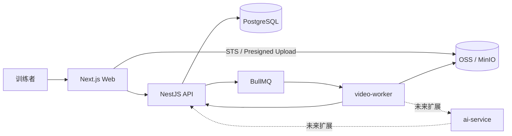
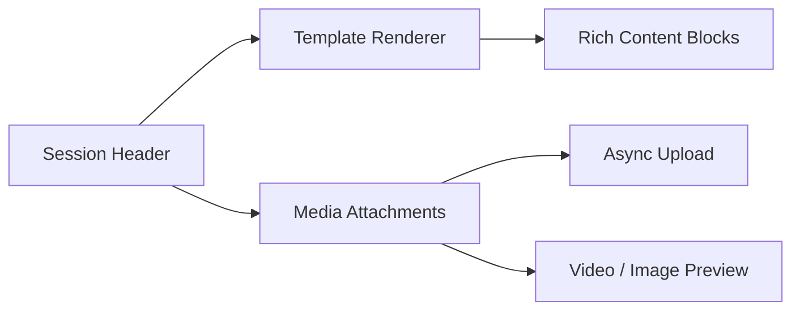
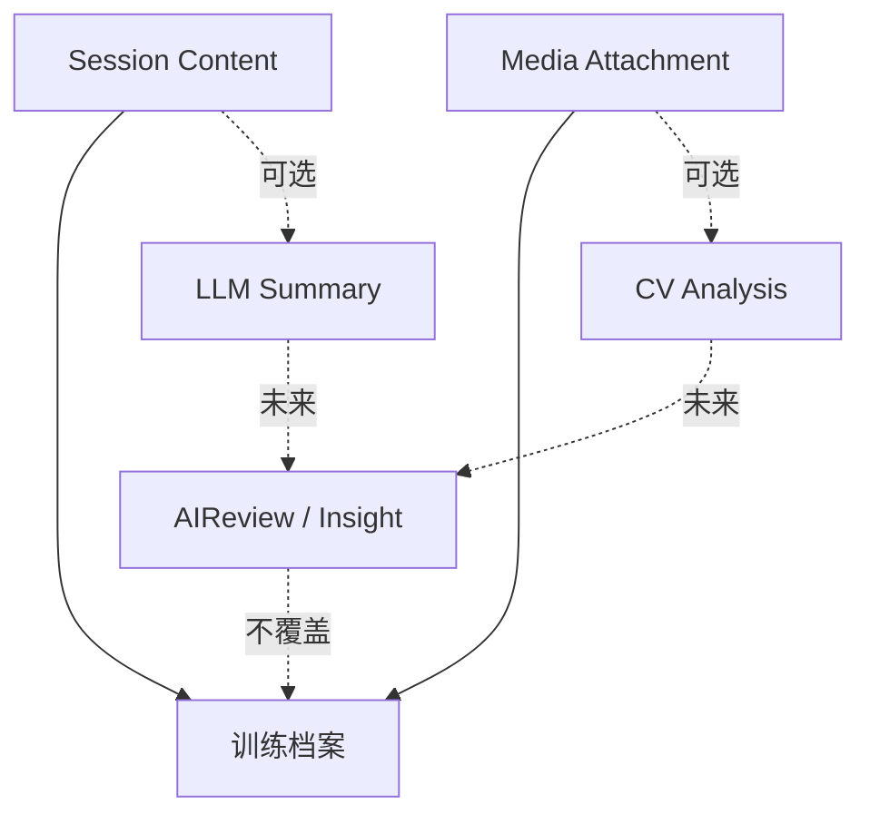

# CornerMan 拳角 · MVP 技术设计文档

> 本文对应 [PRD v1.2](./prd.md)。技术主线为“模板化训练记录 + 富文本内容 + 媒体附件”，本轮（v1.2）补齐：账号前端与登录态续期、数据趋势聚合、实战成败字段、富文本关键帧节点与抽取、跨训练素材库。现有视频上传、对象存储、后台转码、抽帧能力继续复用；AI/CV 相关服务保留为未来扩展层，不驱动主流程。
>
> 配套：[数据趋势方案](./trends-design.md)、[素材库 / 关键帧方案](./media-library-design.md)、[移动端 HIG 规范](./mobile-design.md)。

## 1. 技术目标

新 MVP 要支撑这些事：

1. 用 JSON 模板动态渲染训练复盘编辑区；
2. 将用户富文本内容（含关键帧节点）按 block 结构稳定保存；
3. 支持视频 / 图片 / 关键帧作为素材异步上传与处理，并沉淀为用户级素材库；
4. 提供按周 / 月聚合的训练趋势数据与实战成败统计；
5. 前端补齐登录注册与登录态续期（后端接口已具备）；
6. 为未来 AI/CV 分析预留扩展接口，但不让它影响用户保存复盘。

## 2. 技术栈

| 层 | 选型 | 调整说明 |
| --- | --- | --- |
| Monorepo | `pnpm workspaces` + `Turborepo` | 保持不变 |
| 前端 | `Next.js 14` + `React` + `Tailwind CSS` | 移动端录入优先，PC 做深度整理 |
| 表单 / 管理界面 | `Ant Design` 动态表单能力 | 用于“我的模板”Builder，不强行用于日常复盘编辑器 |
| 富文本 | `TipTap` 或 `Lexical` | MVP 需要标题、列表、加粗、高亮 |
| 后端 | `NestJS` | 新增 templates、session-content、media 管理能力 |
| 数据库 | PostgreSQL + Prisma | Template schema 和 Session content 使用 JSON |
| 对象存储 | MinIO 本地 / 阿里云 OSS 生产 | 沿用当前视频直传模型 |
| 后台任务 | BullMQ + Redis | 视频转码、封面生成继续后台处理 |
| AI/CV | `ai-service` + `video-worker` | 保留为扩展层，不是 MVP 必经链路 |

## 3. 新系统架构



核心变化：

- `Template` 和 `Session.content` 是主数据；
- `MediaAttachment` 是 Session 的素材；
- `AnalysisReport`、`Score`、`VideoSegment` 不再决定 Session 是否完成；
- 用户保存内容不依赖视频处理和 AI 分析结果。

## 4. Monorepo 目录影响

现有目录结构保留，重点调整模块职责：

```text
CornerMan/
├── apps/
│   ├── web/               # 模板选择、富文本编辑器、媒体附件 UI
│   ├── api/               # templates / sessions / media APIs
│   ├── video-worker/      # 视频转码、封面、未来分析入口
│   └── ai-service/        # 未来 CV 扩展，MVP 不作为主链路依赖
├── packages/
│   ├── shared-types/      # Template / Content / Media 类型
│   ├── api-client/        # 新增模板和内容保存接口
│   ├── ui/                # 模板卡、编辑器 block、媒体附件组件
│   └── config/
└── docs/
```

## 5. 核心数据模型

### 5.1 Template

模板分系统内置和用户自定义两类。MVP 推荐用单表 + JSON schema，降低迁移和 Builder 复杂度。

建议字段：

| 字段 | 类型 | 说明 |
| --- | --- | --- |
| `id` | String | 主键 |
| `userId` | String? | 空表示系统模板；有值表示个人模板 |
| `name` | String | 模板名称 |
| `scene` | String | `private_lesson / sparring / self_training / custom` |
| `description` | String? | 模板说明 |
| `schema` | Json | block 定义 |
| `isSystem` | Boolean | 是否系统模板 |
| `version` | Int | 模板版本 |
| `createdAt / updatedAt / deletedAt` | DateTime | 通用字段 |

模板 schema 示例：

```json
{
  "version": 1,
  "blocks": [
    {
      "id": "coach_correction",
      "type": "rich_text",
      "title": "教练重点纠错",
      "placeholder": "记录教练指出的问题、改法和关键词",
      "required": true
    }
  ]
}
```

### 5.2 TrainingSession

现有 `TrainingSession` 保留基础字段，新增模板与内容字段。

建议新增：

| 字段 | 类型 | 说明 |
| --- | --- | --- |
| `templateId` | String? | 创建时选择的模板 |
| `templateSnapshot` | Json | 创建时的模板快照，避免模板后续修改影响旧记录 |
| `content` | Json | 用户填写的 block 内容（含关键帧节点） |
| `outcome` | Json? | 实战成败结构（`result: win/loss/draw/unscored`、对手、回合、暴露问题），见下 |
| `savedAt` | DateTime? | 最近一次用户保存时间 |

`outcome` 示例（仅实战 / 约练类填写，默认 `unscored`）：

```json
{
  "result": "loss",
  "opponent": "蓝队 · 张三",
  "rounds": 3,
  "note": "第二回合被反击，后手直拳回防慢",
  "linkedProblemCodes": ["guard_drop_after_jab"]
}
```

`templateSnapshot` 很关键：用户用某个模板创建 Session 后，即使以后修改模板，历史训练记录也应保持当时的字段结构。

### 5.3 Session Content

内容按 block id 保存，不和模板定义混在一起。

```json
{
  "coach_correction": {
    "type": "rich_text",
    "doc": {
      "type": "doc",
      "content": []
    },
    "plainText": "jab 出完左手回位太慢..."
  },
  "conditioning_rating": {
    "type": "rating",
    "value": 7
  }
}
```

保存 `plainText` 是为了后续搜索、摘要和 AI 扩展，不用每次解析富文本 JSON。

富文本 `doc` 中可包含**关键帧节点**，从训练视频精确时间戳抽取，回看时图文一体（详见 [素材库 / 关键帧方案](./media-library-design.md)）：

```json
{
  "type": "keyframe",
  "attrs": {
    "mediaId": "media_abc",
    "sourceVideoId": "video_123",
    "timeMs": 3467,
    "frameNo": 104,
    "posterObjectKey": "keyframes/video_123/3467.jpg",
    "note": "出右直拳后左手护手掉到下巴以下"
  }
}
```

### 5.4 MediaAttachment

MVP 可以选择两种实现：

1. 复用现有 `Video` 表，先只支持视频；
2. 新增 `MediaAttachment`，统一支持视频和图片。

建议采用第二种，长期更清晰：

| 字段 | 类型 | 说明 |
| --- | --- | --- |
| `id` | String | 主键 |
| `userId` | String | 归属用户（支撑用户级素材库查询） |
| `sessionId` | String? | 来源 Session（关键帧 / 引用素材可跨 Session，故可空） |
| `kind` | String | `video / image / keyframe` |
| `status` | String | `uploading / uploaded / processing / ready / failed` |
| `objectKey` | String | 原始对象 key |
| `originalFileName` | String? | 文件名 |
| `contentType` | String? | MIME |
| `sizeBytes` | Int? | 文件大小 |
| `durationMs` | Int? | 视频时长 |
| `posterObjectKey` | String? | 视频封面 / 图片或关键帧缩略图 |
| `playbackObjectKey` | String? | 转码后播放地址 |
| `sourceVideoId` | String? | 关键帧的来源视频 |
| `timeMs` | Int? | 关键帧在来源视频中的时间戳 |
| `tags` | String[] | 素材库筛选用标签 |
| `analysisStatus` | String? | 未来 AI/CV 分析状态 |
| `analysisResult` | Json? | 未来 AI/CV 结果 |

现有 `Video`、`VideoSegment` 可以在代码改造时迁移或临时兼容；产品层统一称为媒体素材，并以 `userId` 支撑跨训练**素材库**。复盘 content 通过 `mediaId` **引用**素材（非复制），删除被引用素材需校验或提示。

## 6. API 设计

### Auth（已具备，前端复用）

后端已实现，本轮不新增后端，仅前端接入：

| 方法 | 路径 | 说明 |
| --- | --- | --- |
| `POST` | `/auth/register` | `email / username / password / displayName?` |
| `POST` | `/auth/login` | `identifier(邮箱或用户名) / password` |
| `POST` | `/auth/refresh` | `refreshToken` → 新令牌 |
| `GET` | `/auth/me` | Bearer access → 当前用户 |

> 全局前缀 `/api`；access 默认 15m、refresh 30d。前端待补：刷新续期、`me` 校验、统一 401 自动 refresh、登录态守卫（详见 §13）。

### Templates

| 方法 | 路径 | 说明 |
| --- | --- | --- |
| `GET` | `/templates` | 返回系统模板 + 当前用户自定义模板 |
| `GET` | `/templates/:id` | 模板详情 |
| `POST` | `/templates` | 创建自定义模板 |
| `PATCH` | `/templates/:id` | 更新自定义模板 |
| `DELETE` | `/templates/:id` | 软删除自定义模板 |
| `POST` | `/templates/:id/duplicate` | 从系统模板或已有模板复制 |

### Sessions

| 方法 | 路径 | 说明 |
| --- | --- | --- |
| `POST` | `/training-sessions` | 创建 Session，传入 `templateId` |
| `GET` | `/training-sessions` | 列表，支持类型 / 模板 / 日期筛选 |
| `GET` | `/training-sessions/:id` | Session 详情，含模板快照和内容 |
| `PATCH` | `/training-sessions/:id/content` | 保存富文本内容 |
| `PATCH` | `/training-sessions/:id/meta` | 更新日期、类型、地点、时长等基础信息 |

### Media

| 方法 | 路径 | 说明 |
| --- | --- | --- |
| `POST` | `/training-sessions/:id/media/upload-init` | 获取直传凭证 |
| `POST` | `/training-sessions/:id/media/upload-complete` | 上传完成回调，触发后台处理 |
| `GET` | `/training-sessions/:id/media` | 获取当前 Session 附件列表 |
| `GET` | `/media/:id` | 获取附件详情和签名播放 / 预览地址 |
| `POST` | `/media/:id/retry` | 失败后重试处理 |
| `DELETE` | `/media/:id` | 删除附件（被引用时校验 / 提示） |

### Media Library（素材库，用户级）

| 方法 | 路径 | 说明 |
| --- | --- | --- |
| `GET` | `/media` | 当前用户全部素材，支持 `kind / sessionId / from / to / tag` 筛选与分页 |
| `GET` | `/media/:id` | 素材详情 + 签名播放 / 预览地址 |
| `POST` | `/videos/:id/keyframe` | 传 `{ timeMs }`，ffmpeg `-ss` 精确抽帧落 OSS，返回 `MediaAttachment(kind=keyframe)` |

> 关键帧抽取流程：前端先用 `<canvas>` 截当前帧占位并插入富文本，后端精确抽帧 ready 后替换占位图（详见 [素材库方案](./media-library-design.md)）。

### Trends / Metrics（趋势聚合）

| 方法 | 路径 | 说明 |
| --- | --- | --- |
| `GET` | `/metrics/trends` | 入参 `from / to / granularity(week\|month) / metric`，返回按周期聚合的训练量、时长、综合分、关键指标与环比 |
| `GET` | `/metrics/outcomes` | 返回实战成败序列（Form Guide）与胜率 / 状态折线数据 |

聚合来源：`TrainingSession.durationMin / trainedAt / trainingType / outcome`、`Score`、`Video.poseMetrics`。可用 `WeeklyMetric` 预聚合落库降低实时计算压力。无 AI / 视频数据的训练仅计入训练量与主观字段（详见 [趋势方案](./trends-design.md)）。

## 7. 前端页面设计

### 7.1 新建复盘页

路径：`/sessions/new`

结构：

1. 选择模板：私教课、实战、自训、我的模板；
2. 填训练基础信息：日期、训练类型、地点、时长、标题；
3. 创建 Session 后进入编辑器；
4. 可在同页或详情页继续上传媒体。

按钮文案从“开始 AI 复盘”改为“创建复盘”或“开始记录”。

### 7.2 Session 编辑页

路径：`/sessions/[id]`

新信息架构：



PC 布局：

- 左侧 / 主区：模板化富文本编辑器；
- 右侧：媒体附件、基础信息、保存状态；
- 顶部：训练类型、日期、模板名称、保存按钮。

移动端布局：

- 顶部展示 Session 基础信息；
- 编辑器 block 单列；
- 媒体附件折叠到下方或 Tab。

### 7.3 我的模板页

路径：`/templates`

MVP 能力：

- 查看系统模板和个人模板；
- 从系统模板复制；
- 增删改 block；
- 保存为个人模板；
- 用该模板创建复盘。

Builder 可用 Ant Design 的动态表单能力快速完成，优先保证可用，不追求复杂拖拽。

### 7.4 登录 / 注册页

路径：`/login`（保留单页双 Tab）+ 可选 `/register`。

- HIG 风格表单：登录默认在前，可切换注册；大触控、即时校验、清晰错误文案。
- 成功后保存令牌并进入 `/sessions`；详细登录态见 §13。

### 7.5 趋势看板页

路径：`/trends`（现为占位，本轮落地）。

- 顶部时间范围分段控件 + 自定义日期范围 Sheet。
- 核心概览卡 → 实战 Form Guide → 主趋势折线（可切指标）→ 关键指标卡（环比上下）→ 训练结构 → 波峰波谷。
- 图表库选轻量方案（`recharts` / `visx` / 轻量 SVG），移动端首屏一屏内给出关键信息。

### 7.6 素材库页

路径：`/library`（现 `/segments` 占位升级）。

- HIG 缩略图网格 + 筛选（类型 / 训练 / 日期 / 标签）。
- 点击预览：视频进逐帧播放器，图片 / 关键帧全屏；提供「引用到复盘 / 删除」。
- 复盘编辑器内提供「从素材库选择」底部 Sheet 选择器，引用而非复制。

## 8. 富文本编辑器选型

候选：

| 方案 | 优点 | 风险 |
| --- | --- | --- |
| TipTap | React 生态成熟、Schema 可控、扩展丰富 | 需要封装移动端工具栏 |
| Lexical | 性能和架构优秀，适合复杂编辑器 | 初期封装成本略高 |
| textarea + Markdown | 最快 | 不能满足富文本和动态 block 的长期需求 |

建议：MVP 选择 `TipTap`，先实现最小菜单：标题、无序列表、有序列表、加粗、高亮。

## 8.1 移动端优先落地建议

本轮 MVP 移动端优先，前端实现需服务「疲劳场景」，完整规范见 [移动端优先设计规范](./mobile-design.md)。技术选型上走以下捷径：

| 关注点 | 建议 | 说明 |
| --- | --- | --- |
| 动画与跟手感 | 引入 `framer-motion` | Bottom Sheet 弹出、Block 排序、按钮按压（scale 0.95）、上传进度过渡 |
| 卡片视觉 | Tailwind utility | `rounded-2xl`、`shadow-sm`、`backdrop-blur` 快速堆叠现代卡片 |
| 暗色主题 | Tailwind `dark:` | Gym 场景默认提供暗色，全局低成本适配 |
| 移动端组件 | 评估 `Ant Design Mobile` 或 `Zarm` | 借力 Popup、ActionSheet、SwipeAction，省去手势冲突处理 |

关键交互的技术实现要点：

- **新建入口**：首页 `+` FAB + Bottom Sheet（Popup）选择模板，避免整页跳转；下滑或点蒙层关闭。
- **Block 编辑器**：按 `templateSnapshot.blocks` 渲染独立卡片，点击卡片内部直接聚焦；软键盘支持下滑收起（监听滚动手势 blur 当前编辑器）。
- **异步媒体卡片**：选择文件后立即本地生成缩略图占位卡片，遮罩 + 环形进度展示 `uploading -> processing -> ready/failed`；上传走后台，不阻塞富文本编辑，禁止全屏 Loading。
- **自定义模板 Builder**：移动端优先「点击添加 + 长按拖拽把手排序」，桌面端可增强为拖拽；删除用 SwipeAction，对必填项做保护。
- **触控基线**：主 CTA ≥ 48px、FAB ≥ 56px、普通可点元素 ≥ 44px、区块间距 ≥ 12px。

> 与现有桌面端 `Ant Design` 共存时，注意主题令牌对齐，避免移动端与桌面端视觉割裂。

## 9. 后台处理策略

视频处理仍由 `video-worker` 负责：

1. 上传完成后入队；
2. 生成封面、基础元信息和播放版本；
3. 写回附件状态；
4. 不触发报告生成；
5. 未来可在处理完成后异步触发 AI/CV 插件，但结果不影响 Session 保存。

处理失败原则：

- 文本内容不受影响；
- 附件显示失败状态；
- 用户可重试或删除附件。

## 10. AI/CV 扩展层

现有 AI/CV 能力不删除，但重新定义为插件：



约束：

- AI 结果不能覆盖用户原始记录；
- AI 结果必须独立存储，作为建议或洞察展示；
- AI 失败不能影响创建、编辑、保存、回看；
- UI 文案避免“自动纠错”“自动评分”等强承诺。

## 11. 迁移策略

现有代码已有大量 AI 报告相关实现，建议分阶段处理：

1. 保留数据库表和服务，先从 UI 主入口隐藏；
2. 新增 Template 和 Session content 能力；
3. 把 `/sessions/[id]` 默认页改成复盘编辑器；
4. 将原 `ReportPanel`、`ScoreBoard`、`PoseMetricsModule` 标记为实验能力或暂不展示；
5. 后续若需要再把 AI 结果作为 `Insight` 模块挂回详情页。

这样可以减少破坏性迁移，也避免浪费已完成的视频处理基础。

## 12. 质量与验收

技术验收标准：

- Template schema 有运行时校验，非法 block 不进入渲染器；
- Session content 保存接口支持局部更新或防抖保存；
- 富文本内容（含关键帧节点）保存后刷新不丢失；
- 视频/图片上传失败不影响文字内容保存；
- access 过期时能用 refresh 自动续期，未登录访问受保护页跳转登录；
- 趋势接口在缺少 AI / 视频数据时仍返回训练量与主观字段聚合；
- 关键帧抽取失败时富文本占位帧仍可用，不阻塞保存；
- 移动端 390px 宽度下能完成主要录入流程；
- AI/CV 服务关闭时，MVP 主流程仍可完整运行。

## 13. 前端登录态与鉴权

后端 JWT 链路完整（register / login / refresh / me），前端待补：

- **令牌存储**：沿用 `localStorage`（`cm.accessToken / cm.refreshToken / cm.user`），后续可评估 cookie。
- **自动续期**：`api-client` 增加 401 拦截，用 `refreshToken` 调 `/auth/refresh` 续期并重放原请求；refresh 失效则清理并跳登录。
- **登录守卫**：进入受保护页校验登录态（必要时调 `me`），未登录 `replace("/login")`；可用 Next middleware 或统一布局守卫。
- **登录态上下文**：引入 Auth Context 提供当前用户，避免各页重复读 `localStorage`。

## 14. 逐帧复盘播放器（web 实现基准）

原型见 `design-preview/ios-hig/`，已浏览器验证，作为 web 正式实现参照。规格与实现要点见 [素材库 / 关键帧方案 §4](./media-library-design.md)。要点重述：

- 帧步进先 `pause()` 再设 `currentTime`，并在 `pointerdown` 即触发（避免 `preventDefault` 吞掉 `click`）；
- 播放头刷新优先 `requestVideoFrameCallback`，回退 `timeupdate`；
- 帧号 `= round(currentTime * fps)`，fps 优先取真实元数据，未知按 30 估算并标注；
- 「插入这一帧」对接关键帧抽取与富文本节点插入。
