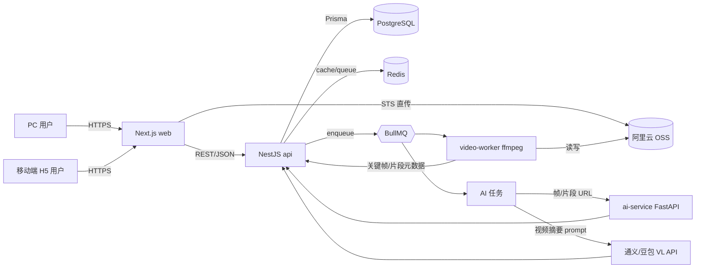
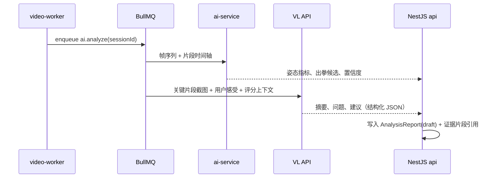
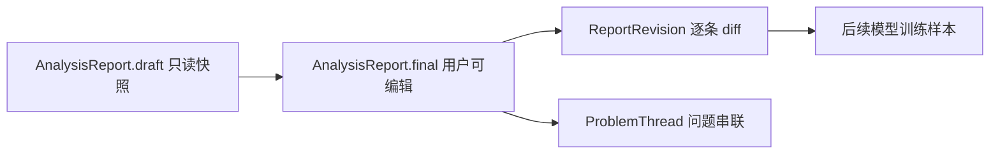

# CornerMan 拳角 · MVP 技术设计文档

> 产品定位与功能范围见 [PRD](./prd.md)。本文只覆盖工程与技术选型。
>
> MVP 唯一用户是训练者本人，核心闭环：**上传 → AI 分析 → 自我补充/校正 → 归档 → 趋势**。不含教练协作、场馆、社交。

## 1. 命名与基调

- 项目代号：`cornerman`（中文：拳角）
- monorepo 根包名：`@cornerman/root`，子包命名空间 `@cornerman/*`
- 部署区域：中国大陆（阿里云）
- AI 策略：混合（Node 主后端 + Python AI 微服务 + 外部多模态 LLM）
- 设计取舍：**单人闭环优先**，所有数据模型按"AI 起草 + 用户定稿"组织，为后续教练协作预留扩展位但不实现。

## 2. 技术栈总览

| 层 | 选型 | 说明 |
| --- | --- | --- |
| 包管理 / 构建 | `pnpm workspaces` + `Turborepo` | 共享缓存，加速 build/lint/test |
| 语言 | TypeScript 全栈 / Python 3.11（AI 子服务） | |
| 后端主服务 | `NestJS` | 模块化清晰，匹配 PRD 模块划分 |
| 数据库 | PostgreSQL 15 + Redis 7 | 业务数据 + 缓存/队列/限流 |
| ORM | `Prisma` | 类型与前端共享 |
| 对象存储 | 阿里云 OSS（STS 临时凭证 + 私有 Bucket） + 阿里云 CDN | 视频直传 |
| 视频处理 | `ffmpeg`（由 Node worker 调度） | 转码、抽帧、缩略图、切片 |
| 任务队列 | `BullMQ`（Redis） | 视频与 AI 任务 |
| AI 子服务 | Python + `FastAPI` + `MediaPipe Pose` / `RTMPose` | 姿态估计与基础动作指标 |
| 多模态 LLM | 通义千问-VL | 训练摘要、问题、建议起草 |
| 前端 | `Next.js 14` App Router + `Tailwind CSS` + 自建响应式组件库 | PC 优先，响应式兼容移动端 H5 |
| 调试 | Chrome DevTools 设备模拟 + 真机 `vConsole` | 双端调试 |
| 鉴权 | 邮箱/用户名 + 密码 注册登录 + JWT | 单人账号，MVP 不接短信，预留三方登录 |
| 部署 | 阿里云 ECS + Docker Compose（MVP），后续可迁移 ACK | |
| CI | GitHub Actions（turbo 远程缓存） | |

## 3. Monorepo 目录结构

```
cornerman/
├── apps/
│   ├── web/               # Next.js 14，PC 主入口，响应式兼容移动端 H5
│   ├── api/               # NestJS 主后端（业务 API + BFF）
│   ├── video-worker/      # Node + BullMQ + ffmpeg，视频处理消费者
│   └── ai-service/        # Python FastAPI，姿态/动作识别
├── packages/
│   ├── shared-types/      # TS 类型：User/TrainingSession/VideoAsset/AnalysisReport 等
│   ├── api-client/        # 前端调用 api 的 SDK（基于 shared-types）
│   ├── ui/                # 响应式组件库（上传、播放器、片段卡片、评分雷达），PC + H5 共用
│   ├── ai-prompts/        # LLM prompt 模板与版本管理
│   └── config/            # eslint、tsconfig、prettier、tailwind 预设
├── docs/
│   ├── prd.md
│   ├── tech-design.md
│   └── product-research.md
├── infra/
│   ├── docker-compose.yml # 本地开发：pg/redis/oss-mock/ai-service
│   └── deploy/            # 生产部署脚本
├── pnpm-workspace.yaml
├── turbo.json
└── package.json
```

## 4. 系统架构



所有用户都是训练者本人，PC 与 H5 同账号、同数据，仅布局不同。

## 5. 关键模块（NestJS api）

对应 PRD 数据对象。每个模块标准三件套：`controller / service / repository(prisma)`；DTO 用 `class-validator`；对外类型从 `@cornerman/shared-types` 复用，避免前后端类型漂移。

- `auth`：邮箱/用户名 + 密码注册登录（bcrypt 哈希）、JWT、会话；预留三方登录 provider 抽象
- `users`：训练者档案、训练经验、站架、目标
- `training-sessions`：训练创建、类型、感受、本次重点、状态机
- `videos`：上传凭证签发、回调、转码状态、片段
- `reports`：AI 报告起草（`draft`）+ 用户定稿（`final`）的组装与读写
- `revisions`：用户对报告条目的增删改记录（采纳/修改/删除/新增）
- `scoring`：5 维评分计算、AI 原始分与用户修订分并存
- `problem-threads`：跨训练贯穿同类问题，状态机（已改进 / 仍存在 / 新增）
- `metrics`：周/月趋势聚合（Postgres 物化视图或定时任务）
- `export`：报告只读链接（脱敏视图）

> 已从 MVP 移除：`coach-feedback`、`notifications`（站内消息）、短信登录、语音转写、PDF 导出。教练协作作为后续扩展，届时在 `reports` 上新增 reviewer 维度即可，当前不建表。

## 6. 视频处理流水线

由 `video-worker` 消费 BullMQ `video.process` 队列：

1. 拉取 OSS 原始视频（或借助 OSS 媒体处理触发回调）
2. `ffmpeg` 生成 720p / 360p 转码版本、首帧封面、每 1s 抽帧用于姿态
3. 基于静音/动作密度做粗切片，产出候选 `VideoSegment`
4. 写回 `videos.processed` 状态，触发 `ai.analyze` 任务

**性能预算**：10 分钟以内训练视频，端到端在 5 分钟内出初步报告。超过该时长走分段处理 + 增量报告。

## 7. AI 流水线与"起草 + 定稿"模型

### 7.0 AI 角色分工（重要：避免混淆）

方案里有两个不同的"AI"，加上一个非 AI 的预处理服务，三者职责不可混为一谈：

| 角色 | 是什么 | 职责 | 输出 | 类比 |
| --- | --- | --- | --- | --- |
| `video-worker`（Node + ffmpeg） | 非 AI 的预处理 | 转码、抽帧、粗切片 | 视频帧、片段时间轴 | 护士（抽血、送检） |
| `ai-service`（Python + 姿态模型） | 自部署的视觉计算 | 从帧里**测量**身体姿态，量化动作 | 关键点坐标、角度、出拳候选、置信度（数字） | 检测仪器（量血压、拍片） |
| LLM（通义千问-VL，外部 API） | 第三方多模态大模型 | 把指标 + 用户感受**写成人话** | 摘要、优点、问题、建议（文字 JSON） | 医生（看数据写诊断） |

核心边界：

- **LLM 不做精确测量**：让大模型直接"看视频说重心偏几度"会编造数字，不可靠；精确几何/姿态必须交给专用姿态模型（`ai-service`）。
- **姿态模型不会说人话**：它只吐关键点坐标，自然语言复盘交给 LLM。
- **MVP 务实路径**：`ai-service` 先做 stub（返回占位数据），优先跑通 `video-worker → LLM → 报告` 链路，姿态测量后补。详见第 7.4 节选型与成本。

### 7.1 生成时序



### 7.2 起草 + 定稿（核心）

报告分两层，对应 PRD 第 8 节：



- `draft` 是 AI 原始输出的只读快照，永不被覆盖；
- 用户在 `final` 上做「采纳 / 修改 / 删除 / 新增」，每个动作落一条 `ReportRevision`，保留 AI 原文与用户结果；
- 评分修正记录 `(ai_score, user_score, delta)`；
- `draft` 与 `revisions` 的差异是后续训练拳击专用模型的高价值样本。

### 7.3 约束

- LLM 输出强制结构化（JSON schema 校验，失败重试 + 降级模板）
- 所有 prompt 在 `@cornerman/ai-prompts` 集中维护，版本号写入 `AnalysisReport.promptVersion`
- 评分可解释：每个维度返回 `score / confidence / evidenceSegmentIds / rationale`
- 成本控制：仅对关键片段调用 VL，普通片段走规则

### 7.4 ai-service（姿态分析）选型与成本

**结论先行**：`ai-service` 不是只能自建。姿态识别这件事本身很成熟，有三条路；MVP 推荐"开源库 + 自己服务器 CPU"或"先不做"，几乎零额外成本。

#### 三种实现路线对比

| 路线 | 做法 | 成本 | 运维 | 适合阶段 |
| --- | --- | --- | --- | --- |
| A. 开源库自建（推荐） | 用 MediaPipe / RTMPose / YOLO-Pose 等免费开源模型，跑在自己的服务器上 | 软件免费；小量用现有 CPU 服务器即可，几乎不增加成本 | 自己维护，但容器化后很简单 | MVP 首选 |
| B. 云 API 直接调用 | 调阿里云视觉智能开放平台「人体关键点检测」、腾讯云人体分析等现成接口 | 按调用次数付费，约每千次几元人民币 | 零运维 | 量小、想最快上线 |
| C. 租 GPU 自建 | 租云 GPU 跑更重的模型 | 按小时计费（见下） | 需要会一点 GPU 运维 | 量大、要更高精度时 |

#### 关键认知（写给非技术读者）

- **姿态识别是"轻量 AI"**：MediaPipe 这类模型在**普通 CPU 甚至浏览器里**就能实时跑，不一定需要 GPU。这和「训练大模型」「跑视频生成」那种烧钱的 AI 完全不是一个量级。
- **MVP 很可能根本不需要 GPU**：训练视频是离线分析、不要求实时直播，用普通服务器 CPU 慢慢算即可。甚至可以把姿态计算放到**用户浏览器端**（MediaPipe 有 JS 版），连服务器都省了。
- **开源不等于要自己训练模型**：MediaPipe/RTMPose 都是别人训练好、可直接调用的免费模型，我们只是"使用"，不是"从头训练"。

#### 成本量级参考（估算，落地前需按当时报价核实）

- **路线 A（开源 + CPU）**：软件 0 成本。MVP 阶段复用已有的 `video-worker` 服务器即可，月成本基本不变（多占一点 CPU 时间）。
- **路线 B（云 API）**：阿里云/腾讯云人体关键点检测约**每千张图几元人民币**。每次训练抽几百帧、只挑关键片段分析的话，单次训练成本通常在几毛到几元。
- **路线 C（租 GPU）**：仅在量大时才需要。入门级 GPU（如 L4 / RTX A5000）海外云约 **$0.3–0.5/小时**，A100 约 **$1.4/小时**；阿里云 GPU 实例价格相近量级。按需启停、不是 7×24 常开的话，月成本可控。

#### 对本项目的建议

1. **MVP 第一步**：`ai-service` 先做 stub（返回占位姿态数据），优先用 LLM 跑通整条报告链路——此时姿态分析成本为 0。
2. **MVP 第二步**：接开源 MediaPipe，跑在现有 CPU 服务器上（路线 A），仍几乎零成本。
3. **如果嫌自建麻烦**：直接调阿里云人体关键点检测 API（路线 B），按量付费、零运维，和现有阿里云生态一致。
4. **只有当用户量和精度要求都上来了**，才考虑路线 C 租 GPU。

> 一句话：姿态分析这块在 MVP 阶段几乎不用为钱担心，真正按调用量花钱的是 LLM（通义千问-VL），那才是需要控成本的地方（见 7.3 仅对关键片段调用）。

## 8. 前端（web）

### 8.1 定位

- **PC 为主，移动端 H5 兼容**：复盘时在 PC 上看视频、拖进度条、逐条修订 AI 结论、打字做笔记效率最高；移动端负责"训练后第一时间上传 + 快速查看 + 语音补一句"。
- 同一套代码、同一份路由、同一份组件库，按断点切换布局，**不做双工程**。

### 8.2 响应式断点

| 断点 | 宽度 | 目标设备 | 布局策略 |
| --- | --- | --- | --- |
| `base` | `< 768px` | 手机 H5 | 单列、底部 Tab 栏、Drawer 抽屉 |
| `md` | `≥ 768px` | 平板 / 小屏笔记本 | 两栏，侧栏可折叠 |
| `lg` / `xl` | `≥ 1024px / 1280px` | PC 主战场 | 三栏：左侧导航 + 中部内容 + 右侧片段/评分面板 |

报告页是典型差异：

- PC：左视频播放器 + 右侧"AI 起草条目 + 一键修订"面板，同屏对照修改；
- 手机：上视频下报告，逐条卡片右上角即可采纳/删除，片段时间线折叠在底部抽屉。

### 8.3 路由

`/login`、`/sessions`、`/sessions/new`、`/sessions/[id]`（报告页）、`/segments/[id]`、`/problems`（问题追踪）、`/trends`，PC 与 H5 共用，仅布局差异。报告导出 `/r/[shareId]` 走 SSR，只读脱敏视图。

### 8.4 上传

- **PC**：拖拽到上传区 + 批量上传，`tus-js-client` 分片直传 OSS，断点续传与并发；
- **H5**：`<input type="file" accept="video/*" capture>` 直接选相册或拍摄；切后台仍可继续（Service Worker 提示），失败自动重试；
- 双端共用 `useVideoUpload` Hook，差异封装在 `packages/ui` 的 `<Uploader>` 内。

### 8.5 视频播放与片段标注

- 基于 `video.js` / `hls.js` 自封装的 `<SegmentPlayer>`：进度条叠加片段标签，支持快捷键（PC：`←/→` 帧跳转、`,`/`.` 微调、空格暂停；H5：点击片段跳转、双指缩放进度条）。
- 用户可在片段上打问题标签、写一句话备注（文字输入）。

### 8.6 报告修订交互

- 每条 AI 结论是一张卡片，含「采纳 / 修改 / 删除」按钮 + 底部「新增我的条目」；
- 修改后小字保留 AI 原文；用户新增条目标记「我补充」；
- 评分用滑块修正，旁边显示 AI 原始分与置信度；
- 「我的补充」为文字输入框（MVP 不做语音转写）；
- 所有修订即时 `PATCH` 到 `revisions`，乐观更新 + 失败回滚。

### 8.7 组件库 `@cornerman/ui`

- 一套组件覆盖两端，通过 Tailwind variants 控制密度与触控尺寸：PC 最小点击区 32px，H5 提升到 44px。
- 关键组件：`Layout`（响应式导航壳）、`Uploader`、`SegmentPlayer`、`ReportItemCard`（含修订操作）、`ScoringRadar`、`TrendChart`、`SessionCard`、`ProblemBadge`、`Drawer`（H5）、`Sidebar`（PC）。
- 图标 `lucide-react`；表单 `react-hook-form` + `zod`。

### 8.8 状态与数据

- React Server Components 渲染列表/详情骨架，`TanStack Query` 管理客户端缓存、上传任务与报告修订的乐观更新；
- 鉴权态写入 `httpOnly cookie`，PC 与 H5 同源同 cookie；
- 响应式信息通过自建 `useBreakpoint()`（基于 `matchMedia`）暴露，避免 SSR 阶段误判设备。

### 8.9 调试与测试

- 开发：Chrome DevTools 设备模拟覆盖主要分辨率（1440 / 1280 / 768 / 390）；
- 真机：H5 通过 `vConsole` 打印日志，PC 走 DevTools；
- E2E：`playwright` 一套用例，以 `desktop-chrome` 和 `iphone-13` 两个 project 运行，关键路径（登录、上传、报告生成、逐条修订、问题追踪、趋势）两端必须通过。

## 9. 鉴权

- MVP：邮箱/用户名 + 密码注册，注册成功后即可登录 → JWT（access 15min + refresh 30d），单人账号。密码用 `bcrypt` 哈希存储。
- 不接短信验证码，降低 MVP 复杂度与成本。
- 预留 `AuthProvider` 抽象，后续可接入短信、微信 H5 OAuth、Apple、Google。
- 无角色体系：MVP 不区分教练/学员，账号即训练者本人。

## 10. 数据库要点

- 训练与视频：`training_sessions`、`videos`、`video_segments`（带 `start_ms / end_ms / tags[] / problem_codes[] / user_note / ai_confidence`）
- 报告版本化：`analysis_reports`（`draft` 只读快照 + `final` 可编辑）+ `report_revisions`（逐条增删改 diff），永不覆盖 AI 原始输出
- 问题追踪：`problem_threads`（同类问题跨训练串联，含 `status`、`occurrences`、`last_seen_at`、`improved_evidence`）+ 关联 `report_item` / `video_segment`
- 评分：`scores`（`ai_score / user_score / confidence / dimension`）
- 趋势聚合：`weekly_metrics` 物化视图，每晚定时刷新
- 软删除：通用 `deleted_at`，视频物理删除走异步清理任务

## 11. 可观测性与质量

- 日志：`pino` + 阿里云 SLS
- 监控：阿里云 ARMS 或自建 Prometheus + Grafana
- 错误：Sentry（前后端）
- 测试：`vitest`（单测） + `playwright`（PC + H5 关键路径，跨设备并行） + `pytest`（ai-service）
- 业务埋点：上传完成、报告生成、**条目修订率**、片段沉淀数、问题状态流转、趋势页访问（对齐 PRD 第 11 节）
- CI：GitHub Actions，turbo 远程缓存；PR 必跑 lint + 单测 + type-check

## 12. 安全与合规

- 视频是用户隐私：OSS Bucket 私有 + 签名 URL + 短期 STS
- 报告只读链接走脱敏视图，默认不暴露原始视频
- 短信、登录、上传接口接入风控限流（Redis 滑动窗口）
- 用户可一键导出/删除全部训练数据

## 13. 里程碑映射（对齐 PRD 6 周）

| 时间 | 阶段 | 工程交付物 |
| --- | --- | --- |
| 第 1-2 周 | 骨架 | monorepo、CI、`api` 鉴权与训练记录、`web` 响应式基础壳（PC + H5）、OSS 上传、视频转码 |
| 第 3-4 周 | AI 闭环 | LLM 起草报告（draft）、5 维评分、证据片段、用户逐条修订（final + revisions） |
| 第 5 周 | 片段与追踪 | 片段库、问题标签、`problem_threads` 跨训练串联 |
| 第 6 周 | 趋势与上线 | 周/月趋势、报告只读链接、埋点、`ai-service` 接入姿态指标、灰度上线 |

## 14. 风险与对策

| 风险 | 对策 |
| --- | --- |
| AI 视频质量波动 | 报告强制带置信度，用户可一键修订/删除任意结论 |
| 用户不愿修订（只默读） | 修订入口做到极轻：一键采纳、滑块改分、卡片右上角即删；埋点监控修订率 |
| LLM 成本 | 仅对关键片段调用 VL，普通片段走规则 |
| 视频上传体验 | 分片直传 + 预压缩 + 后台续传 |
| 团队节奏 | `ai-service` 先出 stub，先跑通端到端，再替换真实姿态模型 |

## 15. 已确认的关键决策

- LLM 服务商：**通义千问-VL**（DashScope SDK）
- 鉴权：**注册即登录（邮箱/用户名 + 密码）**，MVP 不接短信
- 导出：**仅报告只读链接**，不做 PDF
- 语音转写：**MVP 不做**，自我补充走文字输入（后续再加）
