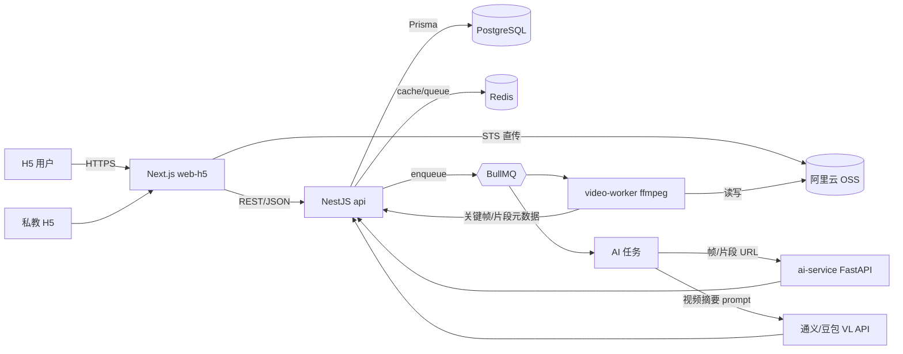
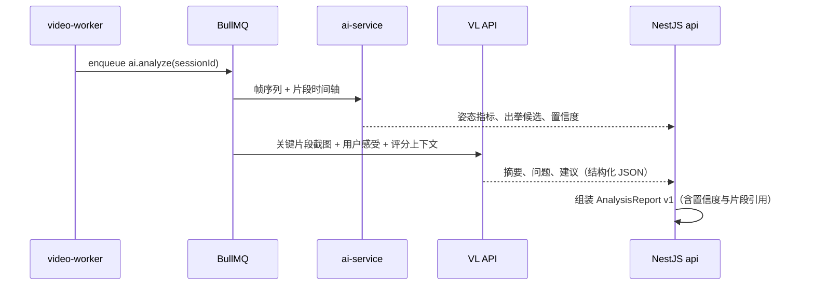

# CornerMan 拳角 · MVP 技术设计文档

> 产品定位与功能范围见 [PRD](./prd.md)。本文只覆盖工程与技术选型。

## 1. 命名

- 项目代号：`cornerman`（中文：拳角）
- monorepo 根包名：`@cornerman/root`
- 子包统一命名空间：`@cornerman/*`
- 部署区域：中国大陆（阿里云）
- AI 策略：混合（Node 主后端 + Python AI 微服务 + 外部多模态 LLM）

## 2. 技术栈总览

| 层 | 选型 | 说明 |
| --- | --- | --- |
| 包管理 / 构建 | `pnpm workspaces` + `Turborepo` | 共享缓存，加速 build/lint/test |
| 语言 | TypeScript 全栈 / Python 3.11（AI 子服务） | |
| 后端主服务 | `NestJS` | 模块化清晰，匹配 PRD 多模块 |
| 数据库 | PostgreSQL 15 + Redis 7 | 业务数据 + 缓存/队列/限流 |
| ORM | `Prisma` | 类型与前端共享 |
| 对象存储 | 阿里云 OSS（STS 临时凭证 + 私有 Bucket） + 阿里云 CDN | 视频直传 |
| 视频处理 | `ffmpeg`（由 Node worker 调度） | 转码、抽帧、缩略图、切片 |
| 任务队列 | `BullMQ`（Redis） | 视频与 AI 任务 |
| AI 子服务 | Python + `FastAPI` + `MediaPipe Pose` / `RTMPose` | 姿态估计与基础动作指标 |
| 多模态 LLM | 通义千问-VL 或 豆包-Vision API | 训练摘要、问题描述、建议生成 |
| 前端 | `Next.js 14` App Router + `Tailwind CSS` + 自建移动端组件库 | H5 优先，SSR 支持分享报告 |
| 调试 | `vConsole` | 真机调试 |
| 鉴权 | 手机号验证码（阿里云短信） + JWT；预留微信 H5 OAuth | |
| 部署 | 阿里云 ECS + Docker Compose（MVP 阶段），后续可迁移到 ACK | |
| CI | GitHub Actions（turbo 远程缓存） | |

## 3. Monorepo 目录结构

```
cornerman/
├── apps/
│   ├── web-h5/            # Next.js 14，移动端 H5，用户主入口
│   ├── api/               # NestJS 主后端（业务 API + BFF）
│   ├── video-worker/      # Node + BullMQ + ffmpeg，视频处理消费者
│   └── ai-service/        # Python FastAPI，姿态/动作识别
├── packages/
│   ├── shared-types/      # TS 类型：User/TrainingSession/VideoAsset/AnalysisReport 等
│   ├── api-client/        # 前端调用 api 的 SDK（基于 shared-types）
│   ├── ui-mobile/         # 移动端组件库（按钮、上传、播放器、片段卡片、评分雷达）
│   ├── ai-prompts/        # LLM prompt 模板与版本管理
│   └── config/            # eslint、tsconfig、prettier、tailwind 预设
├── docs/
│   ├── prd.md
│   ├── tech-design.md
│   └── product-research.md
├── infra/
│   ├── docker-compose.yml # 本地开发：pg/redis/oss-mock/ai-service
│   └── deploy/            # 生产部署脚本
├── pnpm-workspace.yaml
├── turbo.json
└── package.json
```

## 4. 系统架构



## 5. 关键模块（NestJS api）

对应 PRD 中的数据对象，拆分为以下模块。每个模块标准三件套：`controller / service / repository(prisma)`；DTO 使用 `class-validator`；对外类型从 `@cornerman/shared-types` 复用，避免前后端类型漂移。

- `auth`：手机号验证码、JWT、会话；预留 wechat-oauth provider
- `users`：用户档案、训练经验、目标
- `training-sessions`：训练创建、感受、目标、状态机
- `videos`：上传凭证签发、回调、转码状态、片段
- `reports`：AI 报告组装、版本、人工修订
- `scoring`：5 维评分计算与历史
- `coach-feedback`：批注、改分、作业
- `metrics`：周/月趋势聚合（Postgres 物化视图或定时任务）
- `notifications`：站内消息 + 短信（阿里云短信）

## 6. 视频处理流水线

由 `video-worker` 消费 BullMQ `video.process` 队列：

1. 拉取 OSS 原始视频（或借助 OSS 媒体处理触发回调）
2. `ffmpeg` 生成 720p / 360p 转码版本、首帧封面、每 1s 抽帧用于姿态
3. 基于静音/动作密度做粗切片，产出候选 `VideoSegment`
4. 写回 `videos.processed` 状态，触发 `ai.analyze` 任务

**性能预算**：10 分钟以内训练视频，端到端在 5 分钟内出初步报告。超过该时长走分段处理 + 增量报告。

## 7. AI 流水线



- LLM 输出强制结构化（JSON schema 校验，失败重试 + 降级模板）
- 所有 prompt 在 `@cornerman/ai-prompts` 集中维护，带版本号写入 `AnalysisReport.promptVersion`
- 评分可解释：每个维度返回 `score / confidence / evidenceSegmentIds / rationale`
- 用户/教练修订写入 `report_revisions` 表，作为后续模型训练数据
- 成本控制：仅对关键片段调用 VL，普通片段走规则

## 8. 前端（web-h5）

- 路由：`/login`、`/sessions`、`/sessions/new`、`/sessions/[id]`（报告页）、`/segments/[id]`、`/trends`、`/coach/*`
- 上传：分片直传 OSS，前端拿 STS；失败可断点续传
- 视频播放：`hls.js` + 自建片段标尺（在进度条上叠加问题标签）
- 移动端适配：`viewport` + `rem/vw` + 安全区域；底部 tab 栏
- 状态管理：React Server Components + `TanStack Query`（客户端缓存）
- 报告分享：`/r/[shareId]` 走 SSR，无需登录可查看脱敏版

## 9. 鉴权与多端

- MVP：手机号 + 短信验证码 → JWT（access 15min + refresh 30d）
- 预留 `AuthProvider` 抽象，后续接入微信 H5 OAuth、Apple、Google
- 教练 / 学员同账号体系，用 `roles` + `coach_links` 表区分关系

## 10. 数据库要点

- 视频与片段：`videos`、`video_segments`（带 `start_ms / end_ms / tags[] / problem_codes[]`）
- 报告版本化：`analysis_reports` + `report_revisions`，避免覆盖 AI 原始输出
- 趋势聚合：`weekly_metrics` 物化视图，每晚定时刷新
- 软删除：通用 `deleted_at`，视频物理删除走异步清理任务

## 11. 可观测性与质量

- 日志：`pino` + 阿里云 SLS
- 监控：阿里云 ARMS 或自建 Prometheus + Grafana
- 错误：Sentry（前后端）
- 测试：`vitest`（单测） + `playwright`（H5 关键路径） + `pytest`（ai-service）
- CI：GitHub Actions，turbo 远程缓存；PR 必跑 lint + 单测 + type-check

## 12. 安全与合规

- 视频是用户隐私：OSS Bucket 私有 + 签名 URL + 短期 STS
- 分享链接走脱敏视图，默认不暴露原始视频
- 短信、登录、上传接口接入风控限流（Redis 滑动窗口）
- 用户可一键导出/删除全部训练数据

## 13. 里程碑映射（对齐 PRD 8 周）

| 时间 | 工程交付物 |
| --- | --- |
| 第 1-2 周 | 搭 monorepo、CI、`api` 鉴权与训练记录、`web-h5` 基础壳与 OSS 上传 |
| 第 3-4 周 | 视频转码、片段切分、LLM 摘要、报告页 v1 |
| 第 5-6 周 | 5 维评分 + 教练批注 + 片段库 |
| 第 7-8 周 | 趋势看板、分享报告、AI 服务接入姿态指标、灰度上线 |

## 14. 风险与对策

| 风险 | 对策 |
| --- | --- |
| AI 视频质量波动 | 报告强制带置信度 + 教练可修订 |
| LLM 成本 | 仅对关键片段调用 VL，普通片段走规则 |
| 视频上传体验 | 分片直传 + 预压缩 + 后台续传 |
| 团队节奏 | Python AI 服务优先做 stub，先跑通端到端，再替换真实模型 |

## 15. 待确认事项

- LLM 服务商首选：通义千问-VL vs 豆包-Vision（影响 SDK 与 prompt 调优）
- 是否需要私教版独立入口（同账号不同视图 vs 独立子应用）
- 是否启用微信小程序版本（影响是否在 monorepo 增加 `apps/mini`）
