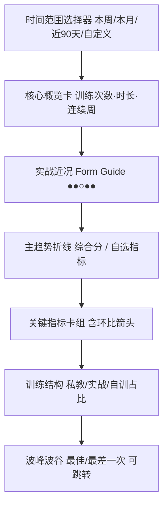
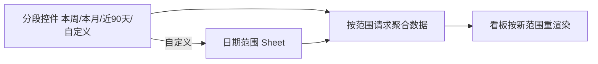

# CornerMan 拳角 · 数据趋势与战绩展示方案

> 本文对应 [PRD v1.2](./prd.md) 与 [技术设计 v1.2](./tech-design.md)，并遵循 [移动端优先设计规范](./mobile-design.md) 中确立的 **Apple HIG 视觉基准**（参照 `design-preview/ios-hig/`）。
>
> 解决的问题：训练记录沉淀之后，用户需要回答三个问题——「我最近练得勤不勤」「我的状态在变好还是变差」「上次输在哪、改了没」。本文给出**数据趋势看板**、**实战成败（上下波动）展示**与**日期 / 时间范围选择**三套方案。

## 0. 设计原则：呈现「状态曲线 + 问题闭环」，不做 KPI 压迫

训练是长期、有起伏的过程。趋势页的目标不是给用户打分排名，而是让他**看见自己的状态曲线，并把每一次「下滑 / 失败」转化为一条可复盘、可改进的具体记录**。

| 准则 | 含义 |
| --- | --- |
| 趋势优先于单点 | 强调折线方向和环比，而不是孤立的某次高分 / 低分 |
| 失败可复盘 | 任何波谷、负场都能一键跳回那次复盘，把「输」变成「输在哪」 |
| 负向不刺眼 | 下滑不用刺眼红色告警；用中性 / 橙色，配「暴露的问题」入口 |
| 闭环导向 | 负场卡片高亮「本场暴露问题 → 是否已在后续训练改进」，与问题追踪联动 |
| 移动端优先 | 看板首屏在手机一屏内给出「近况 + 一条主曲线 + 关键指标卡」 |

## 1. 数据来源：哪些字段可以画趋势

趋势完全基于已沉淀的训练数据聚合，**不依赖 AI**。可用字段（详见 [技术设计](./tech-design.md) 数据模型）：

| 维度 | 字段来源 | 适合的图 |
| --- | --- | --- |
| 训练量 | `TrainingSession.trainedAt` 计数、`durationMin` 求和 | 柱状（周 / 月训练次数与时长） |
| 训练结构 | `trainingType`（私教 / 实战 / 自训）分布 | 堆叠柱 / 占比环 |
| 主观状态 | 模板内 `rating` block（体能、执行满意度等） | 折线 |
| 综合表现 | `Score.overall` 及各维度（步伐 / 防守 / 出拳等） | 折线 / 雷达 |
| 客观指标 | `Video.poseMetrics`（出拳次数、频率、护手率、高强度占比等） | 折线 |
| 实战战绩 | `TrainingSession.outcome`（胜 / 负 / 平，见 §3） | Form Guide + 胜率折线 |

> 趋势看板对 AI/CV 结果「能用则用、缺失不报错」：没有 `Score` / `poseMetrics` 的训练只统计训练量与主观字段。

## 2. 数据趋势看板（/trends）

### 2.1 信息架构（移动端首屏，自上而下）



### 2.2 模块说明

- **核心概览卡**：当前范围内训练次数、总时长、连续训练周数（`consecutiveWeeks` 已有客户端实现，迁移为后端聚合）。
- **主趋势折线**：默认画「综合分」，顶部可切换指标（综合分 / 出拳次数 / 护手率 / 体能自评…）。HIG 风格：细线、圆点标记、点击数据点弹出该次训练摘要并可跳转复盘。
- **关键指标卡组**：每张卡 = 指标名 + 当前周期均值 + **环比箭头**（见 §4），点击进入该指标的单指标趋势详情。
- **训练结构**：按训练类型的占比 / 堆叠柱，帮助用户发现「最近只练自训、缺少实战」。
- **波峰波谷**：在主曲线上标注区间内最佳 / 最差一次，卡片化展示并跳转对应复盘。

### 2.3 不做什么

- 不做与他人对比的排行榜 / 社区榜单；
- 不把单次低分包装成「警告 / 不及格」；
- 不强制用户填满所有可量化字段，缺数据时图表降级而非报错。

## 3. 实战成败（上下波动）如何展示

> 这是本轮重点设计问题：「如果训练次数有成败上下，该如何展示？」

### 3.1 数据建模：给实战一个结构化「结果」

实战 / 约练类 Session 增加结构化 `outcome` 字段（自训、私教默认不计胜负）：

```json
{
  "outcome": {
    "result": "win",          // win | loss | draw | unscored(约练不计胜负)
    "opponent": "蓝队 · 张三",
    "rounds": 3,
    "note": "第二回合被反击打到，后手直拳回防慢",
    "linkedProblemCodes": ["guard_drop_after_jab"]
  }
}
```

- 录入入口在实战模板顶部，用 HIG 分段控件（`胜 / 负 / 平 / 不计`）一键选择，**默认「不计」**，避免给日常约练强加胜负压力。
- `result` 可空——用户不想记胜负时完全不影响其它流程。

### 3.2 展示一：Form Guide 近况条（一眼看手感）

借鉴体育「近 5 场战绩」：用一串圆点表示最近 N 次实战。

```text
近期实战   ● ● ○ ◐ ●        3 胜 1 负 1 平
           胜 胜 负 平 胜
```

- `●` 胜（实心 / 系统绿）、`○` 负（描边 / 中性灰，**不用红**）、`◐` 平。
- 整条可横向滚动查看更早记录；点任一圆点跳到那场复盘。
- 放在看板「实战近况」区，也复用在训练列表头部。

### 3.3 展示二：胜率 / 状态折线（看趋势不看单点）

- 按周（或自定义粒度）聚合胜率或综合分，画折线。
- **上行用强调色（系统绿），下行用中性 / 橙色**，弱化「失败」的视觉惩罚，强调「方向」。
- 在折线上叠加每周实战次数（淡色柱），避免「3 战 3 胜」和「1 战 1 胜」被同等解读。

### 3.4 展示三：环比指标卡（量化「上下」）

每个关键指标卡显示「当前值 + 与上一周期对比」：

```text
┌──────────────────────────┐
│ 护手率            ↓ 6%    │   ← 下降用橙色，不用刺眼红
│ 72%                       │
│ 暴露问题：出拳后护手回位慢 →│   ← 链接到对应复盘 / 问题线程
└──────────────────────────┘
```

详细的「上下」语义见 §4。

### 3.5 展示四：把「输」变成「可复盘的一次」

- 负场卡片不只是记一个 L，而是高亮 **本场暴露问题** 列表，并显示「是否已在后续训练改进」。
- 与 [问题追踪](#) 联动：负场录入的 `problemCode` 自动汇入问题线程；当后续训练同一问题分数回升或被标记「已改进」，负场卡片显示「✅ 已改进」徽标，完成「失败 → 复盘 → 改进」的闭环。

### 3.6 设计取舍

- 胜负只是**众多维度之一**，看板默认更突出「状态曲线 + 问题闭环」，而非比赛战绩，防止把训练记录工具异化为输赢计分器。
- 允许用户完全不记录胜负，趋势页据此自动隐藏战绩模块。

## 4. 「上 / 下」的统一语义：环比与波峰波谷

为了让各处「上升 / 下降」表达一致：

| 表达 | 规则 |
| --- | --- |
| 环比箭头 | 当前周期均值 vs 上一周期均值；`↑` 上升、`↓` 下降、`–` 持平（阈值内不显示箭头，避免噪声） |
| 颜色 | 上升 = 系统绿；下降 = 系统橙 / 中性，不用告警红；中性变化 = 灰 |
| 波峰 / 波谷 | 当前范围内的最佳 / 最差点，曲线上加标记并可跳转复盘 |
| 数据不足 | 周期内样本 < 2 时不算环比，显示「数据积累中」 |

## 5. 日期与时间范围选择

涉及两类「日期」交互，统一走 HIG 风格（参照 `design-preview/ios-hig/`）。

### 5.1 复盘的训练日期（单日选择）

- 每条复盘需要「训练日期 `trainedAt`」。新建时默认今天，可改。
- 移动端用 HIG 风格 **inline 日历 / wheel 日期选择器**（弹出 Sheet，不整页跳转），大触控、可快速选「今天 / 昨天」。
- 编辑器顶部以「6 月 12 日 · 周五 · 实战」形式展示，点击即唤起日期选择 Sheet。

### 5.2 趋势看板的时间范围（区间选择）

- 顶部分段控件预设：`本周 / 本月 / 近 90 天 / 自定义`。
- 「自定义」唤起起止日期选择 Sheet（HIG 日期范围）。
- 选择后整页趋势数据按范围重新聚合；范围状态在前端 URL query 保留，便于回看。



## 6. 技术落地要点（详见技术设计）

| 关注点 | 方案 |
| --- | --- |
| 聚合接口 | 新增 `GET /metrics/trends?from&to&granularity&metric`，后端按周 / 月聚合，复用 `Score`、`poseMetrics`、`outcome`、`durationMin` |
| 战绩字段 | `TrainingSession.outcome`（JSON），实战模板录入；列表 / 看板可查询 |
| 周期缓存 | `WeeklyMetric` 类型已存在，可作为预聚合落库结构，降低实时计算压力 |
| 图表库 | 移动端轻量优先（如 `recharts` / `visx` / 轻量 SVG 折线），避免重型图表包 |
| 环比计算 | 后端返回当前与上一周期均值，前端只做展示，保证多端一致 |

## 7. 验收清单

- [ ] `/trends` 可按「本周 / 本月 / 近 90 天 / 自定义」聚合并渲染
- [ ] 主趋势折线可切换指标，数据点可跳转对应复盘
- [ ] 关键指标卡显示环比箭头，颜色遵循上绿 / 下橙中性规则
- [ ] 实战可录入 `胜 / 负 / 平 / 不计`，默认「不计」
- [ ] Form Guide 近况条正确展示并可跳转
- [ ] 负场卡片展示暴露问题，并在改进后显示「已改进」
- [ ] 无 AI / 无视频数据的训练也能进入训练量与主观字段统计
- [ ] 移动端首屏一屏内给出「近况 + 主曲线 + 关键指标卡」
